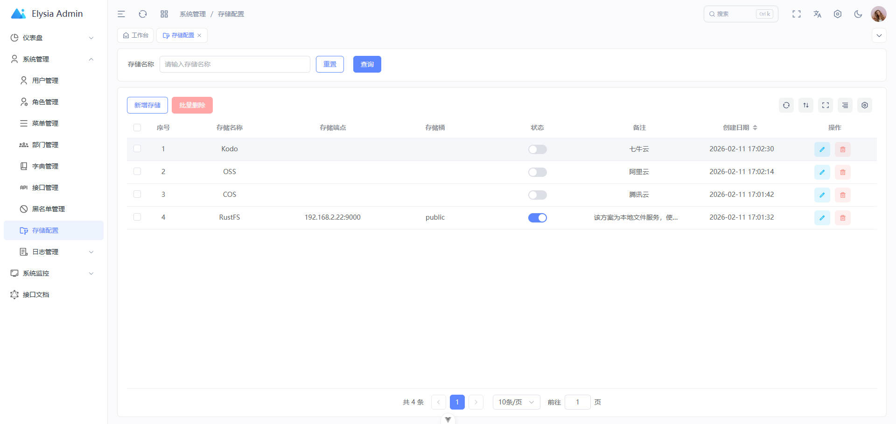

<p align="center">
  <a href="https://elysiajs.com">
    <picture>
      <source media="(prefers-color-scheme: dark)" srcset="https://elysia.zhcndoc.com/assets/elysia.svg">
      
    </picture>
    <h1 align="center">Elysia Admin</h1>
  </a>
</p>

一个基于 Elysia.js + Art Design Pro 的现代化全栈后台管理系统。



这是一个前后端分离的企业级后台管理系统，采用最新的技术栈构建：

- **后端**: Elysia.js + Bun + PostgreSQL + Redis + Drizzle ORM
- **前端**: Vue 3 + TypeScript + Element Plus + Vite + Pinia

## 技术栈

### 后端技术栈

- **运行时**: [Bun](https://bun.sh/) - 高性能 JavaScript 运行时
- **框架**: [Elysia.js](https://elysiajs.com/) - 快速、轻量的 Web 框架
- **数据库**: [PostgreSQL](https://www.postgresql.org/) 16+
- **缓存**: [Redis](https://redis.io/) 6+
- **ORM**: [Drizzle ORM](https://orm.drizzle.team/) - 类型安全的 ORM
- **认证**: JWT (jose)
- **定时任务**: Croner
- **邮件服务**: Nodemailer

### 前端技术栈

- **框架**: Vue 3.5+ (Composition API)
- **构建工具**: Vite 7+
- **UI 框架**: Element Plus 2.11+
- **状态管理**: Pinia 3+
- **路由**: Vue Router 4+
- **HTTP 客户端**: Axios
- **图表**: ECharts 6+
- **富文本编辑器**: WangEditor 5+
- **样式**: Tailwind CSS 4+ + SCSS
- **国际化**: Vue I18n 9+
- **工具库**: VueUse, dayjs, lodash

## 功能特性

### 系统管理
- 用户管理 - 用户增删改查、角色分配
- 角色管理 - 角色权限配置
- 菜单管理 - 动态菜单配置
- 部门管理 - 组织架构管理
- 字典管理 - 系统字典维护
- API 管理 - 接口权限管理
- 存储管理 - 文件上传管理
- IP 黑名单 - IP 访问控制

### 系统监控
- 在线用户 - 在线用户监控
- 定时任务 - 任务调度管理
- 缓存监控 - Redis 缓存监控
- 登录日志 - 用户登录记录
- 操作日志 - 用户操作记录

### 其他功能
- 用户认证 - 登录、注册、忘记密码
- 权限控制 - 基于角色的访问控制 (RBAC)
- 数据权限 - 部门数据权限控制
- IP 限流 - 接口访问频率限制
- 多主题切换 - 亮色/暗色主题
- 多语言支持 - 中文/英文
- 响应式布局 - 适配多种设备

## 软件依赖

### 后端依赖
- [Bun](https://bun.sh/) 1.2.21+
- [PostgreSQL](https://www.postgresql.org/) 16+
- [Redis](https://redis.io/) 6+
- [PM2](https://pm2.keymetrics.io/) (可选，用于生产环境部署)

### 前端依赖
- [Node.js](https://nodejs.org/) 20.19.0+
- [pnpm](https://pnpm.io/) 8.8.0+

## 快速开始

### 1. 克隆项目

```bash
git clone <repository-url>
cd elysia-admin
```

### 2. 后端启动

```bash
cd server

# 安装依赖
bun install

# 配置环境变量
# 复制 src/config/development.yaml 并修改数据库配置

# 推送数据库结构
bun run db:push

# 运行种子数据（可选）
bun run script/seed.ts

# 启动开发服务器
bun dev
```

后端服务将运行在 `http://localhost:3000`

### 3. 前端启动

```bash
cd admin

# 安装依赖
pnpm install

# 配置环境变量
# 修改 .env.development 文件中的 API 地址

# 启动开发服务器
pnpm dev
```

前端服务将自动打开浏览器访问 `http://localhost:5173`

## 项目结构

```
elysia-admin/
├── admin/                    # 前端项目
│   ├── src/
│   │   ├── api/             # API 接口
│   │   ├── assets/          # 静态资源
│   │   ├── components/      # 组件
│   │   ├── config/          # 配置文件
│   │   ├── directives/      # 自定义指令
│   │   ├── hooks/           # 组合式函数
│   │   ├── locales/         # 国际化
│   │   ├── router/          # 路由配置
│   │   ├── store/           # 状态管理
│   │   ├── types/           # 类型定义
│   │   ├── utils/           # 工具函数
│   │   └── views/           # 页面视图
│   └── package.json
│
├── server/                   # 后端项目
│   ├── database/            # 数据库相关
│   │   ├── schema/          # 数据表结构
│   │   └── drizzle/         # Drizzle 迁移文件
│   ├── src/
│   │   ├── config/          # 配置文件
│   │   ├── constants/       # 常量定义
│   │   ├── core/            # 核心功能
│   │   ├── guards/          # 守卫/中间件
│   │   ├── infrastructure/  # 基础设施
│   │   ├── middleware/      # 中间件
│   │   ├── modules/         # 业务模块
│   │   ├── shared/          # 共享工具
│   │   └── types/           # 类型定义
│   └── package.json
│
└── README.md
```

## 部署

### 后端部署

#### 方式一：普通 JS 部署

```bash
cd server

# 构建项目
NODE_ENV=production bun run build

# 使用 PM2 启动
pm2 start dist/ecosystem.config.cjs

# 查看运行状态
pm2 status

# 查看日志
pm2 logs
```

#### 方式二：二进制部署

```bash
cd server

# 构建二进制文件（注意：无法跨平台编译）
NODE_ENV=production bun run build:binary

# 运行二进制文件
./dist_binary/server
```

#### 方式三：Docker 部署

```bash
cd server

# 构建镜像
bun run docker:build

# 运行容器
bun run docker:run

# 查看日志
bun run docker:logs
```

### 前端部署

```bash
cd admin

# 构建生产版本
pnpm build

# 构建产物在 dist 目录，可部署到任何静态服务器
# 如 Nginx, Apache, Vercel, Netlify 等
```

## 文件存储

系统支持多种文件存储方式：

- 本地存储
- 阿里云 OSS
- 腾讯云 COS
- 七牛云
- MinIO
- RustFS

### 使用 RustFS（推荐用于本地开发）

```bash
docker run -d --name rustfs_container \
  --user root \
  -p 9000:9000 \
  -p 9001:9001 \
  -v /mnt/rustfs/data:/data \
  -e RUSTFS_ACCESS_KEY=rustfsadmin \
  -e RUSTFS_SECRET_KEY=rustfsadmin \
  -e RUSTFS_CONSOLE_ENABLE=true \
  rustfs/rustfs:latest \
  --address :9000 \
  --console-enable \
  --access-key rustfsadmin \
  --secret-key rustfsadmin \
  /data
```

访问控制台: `http://localhost:9001`

## 开发指南

### 后端开发

- 查看 [server/docs/project-structure.md](server/docs/project-structure.md) 了解项目结构
- 查看 [server/docs/cron-task.md](server/docs/cron-task.md) 了解定时任务
- 查看 [server/docs/transaction.md](server/docs/transaction.md) 了解事务处理

### 前端开发

- 遵循 Vue 3 Composition API 最佳实践
- 使用 TypeScript 进行类型检查
- 遵循 ESLint 和 Prettier 代码规范

```bash
# 代码检查
pnpm lint

# 代码格式化
pnpm lint:prettier

# 样式检查
pnpm lint:stylelint
```

## 环境变量配置

### 后端配置 (server/src/config/)

```yaml
# development.yaml / production.yaml
server:
  port: 3000
  
database:
  host: localhost
  port: 5432
  database: elysia_admin
  username: postgres
  password: your_password

redis:
  host: localhost
  port: 6379
  password: your_password
  db: 0

jwt:
  secret: your_jwt_secret
  expiresIn: 7d
```

### 前端配置 (admin/)

```env
# .env.development
VITE_API_BASE_URL=http://localhost:3000
VITE_APP_TITLE=Elysia Admin

# .env.production
VITE_API_BASE_URL=https://your-api-domain.com
VITE_APP_TITLE=Elysia Admin
```

## 常见问题

### 1. Bun 安装失败？

访问 [Bun 官方文档](https://bun.sh/docs/installation) 查看安装指南。

### 2. 数据库连接失败？

检查 PostgreSQL 是否正常运行，配置文件中的数据库信息是否正确。

### 3. Redis 连接失败？

检查 Redis 是否正常运行，配置文件中的 Redis 信息是否正确。

### 4. 前端请求跨域？

确保后端已启用 CORS，或使用 Vite 代理配置。

## 贡献指南

欢迎提交 Issue 和 Pull Request！

1. Fork 本仓库
2. 创建特性分支 (`git checkout -b feature/AmazingFeature`)
3. 提交更改 (`git commit -m 'Add some AmazingFeature'`)
4. 推送到分支 (`git push origin feature/AmazingFeature`)
5. 提交 Pull Request

## 许可证

[MIT License](LICENSE)

## 联系方式

如有问题或建议，欢迎通过 Issue 联系。

---

⭐ 如果这个项目对你有帮助，请给个 Star 支持一下！
