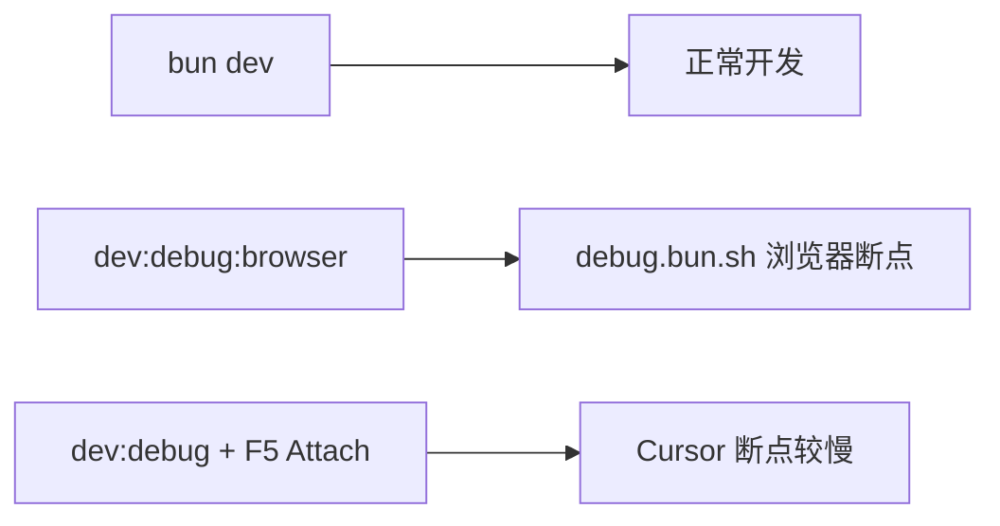

# 内置命令

这里将详细说明项目中内置的各种命令及其使用方法，可以帮助团队成员快速了解和使用这些命令。

## 基本命令

### dev
在开发环境下启动后端服务（仅主进程）。

**使用方式：**
```bash [bun]
bun dev
```

### dev:workers
构建 Processor 文件后启动 Worker 进程（定时任务、队列消费）。

**使用方式：**
```bash [bun]
bun dev:workers
```

### dev:all
同时启动主进程和 Worker 进程，两个进程的日志合并输出，`[server]` 和 `[workers]` 前缀区分，Ctrl+C 同时关闭。

**使用方式：**
```bash [bun]
bun dev:all
```

**指定运行环境：**
::: code-group
```bash [windows]
$env:NODE_ENV="development"; bun dev:all
```

```bash [linux]
NODE_ENV="development"; bun dev:all
```

```bash [macos]
NODE_ENV="development"; bun dev:all
```
:::

## 调试命令

以下命令在 **`server/`** 目录下执行。日常开发仍用 `bun dev`；仅在需要断点调试时使用下列命令。

- **日常开发**：`bun dev`
- **断点调试（推荐）**：`bun run dev:debug:browser`，配合浏览器 [debug.bun.sh](https://debug.bun.sh) 设断点
- **IDE Attach（Cursor / VS Code F5）**：`bun run dev:debug` 或 launch 配置（暂停约 1s，属 Bun + js-debug 协议限制）



### dev:debug

以 `--inspect=6499` 启动主进程，供 Cursor / VS Code **Attach** 调试。不含 `--watch`，避免调试时反复重载。

**使用方式：**
```bash [bun]
cd server
bun run dev:debug
```

配合 Run and Debug 面板中的 **`Debug Server (IDE, 较慢)`**：F5 会自动执行 `Server: dev:debug` 任务并 Attach 到 6499 端口。

### dev:debug:browser

通过 `dev:debug:browser` 启动 inspect，终端打印提示后拉起 `src/index.ts`。**Bun 官方推荐的调试方式**，比 IDE Attach 更流畅。

**使用方式：**
```bash [bun]
cd server
bun run dev:debug:browser
```

启动后复制终端中的 `https://debug.bun.sh/#localhost:6499/...` 链接到浏览器，在 Sources 面板设断点并触发 API。

### dev:debug:watch

同时开启 `--inspect=6499` 与 `--watch`（热重载）。调试与 Attach 叠加时易卡顿或反复重连，**仅在确需边改代码边调试时使用**，默认不推荐。

**使用方式：**
```bash [bun]
cd server
bun run dev:debug:watch
```

**编辑器配套（VS Code / Cursor）**：打开项目根目录的多根工作区后，可通过 **Terminal → Run Task** 运行 `Server: dev:debug (browser, 推荐)` 或 `Server: dev:debug`；在 **Run and Debug** 面板可选用 `Debug Server (IDE, 较慢)`（一键 Attach）或 `Attach Server (6499)`（服务已手动启动后连接）。

## 构建命令

### build
构建后端服务，生成生产环境代码。同时会构建 Worker 进程和所有 Processor 文件。

**使用方式：**
```bash [bun]
bun build
```

**推荐使用方式（设置生产环境变量）：**
::: code-group
```bash [windows]
$env:NODE_ENV="production"; bun run build
```

```bash [linux]
NODE_ENV="production" bun run build
```

```bash [macos]
NODE_ENV="production" bun run build
```
:::

**构建产物：**
```bash [terminal]
dist/
├── index.js              # 主进程
├── workers.js            # Worker 进程
├── cjs/                  # BullMQ 沙箱 bootstrap（自动复制）
├── processors/           # 各队列 Processor
│   ├── system-cron.js
│   ├── flow-buffer.js
│   └── trade-order.js
└── production.yaml       # 配置文件
```

### build:processors
单独构建所有 Processor 文件，开发时修改 `processor.ts` 后执行。

**使用方式：**
```bash [bun]
bun build:processors
```

## 测试命令

以下命令在 **`server/` 目录**下执行，使用 Bun 内置测试运行器，无需额外安装测试框架。

测试用例位于 `server/test/`，通过 `test/preload.ts` 在加载被测模块前将配置指向 `src/config/development.yaml`（因 `bun test` 默认会把 `NODE_ENV` 设为 `test`，否则会查找不存在的 `test.yaml`）。

当前覆盖范围：**纯函数**（校验、树结构、时间、bcrypt、IP/UA 解析等）与 **`CreateQueryBuilder.build()`**；不包含 handle 层、真实 DB/Redis 连接及网络请求类函数。

### test
运行全部单元测试一次。

**使用方式：**
```bash [bun]
cd server
bun test
```

### test:watch
监听 `server/test/` 与相关源码变更，自动重新运行测试。

**使用方式：**
```bash [bun]
cd server
bun test:watch
```

### test:coverage
运行测试并输出覆盖率报告。

**使用方式：**
```bash [bun]
cd server
bun test:coverage
```

## 数据库命令

以下命令用于数据库配置管理，**仅建议在开发环境下使用**。

### db:push
将本地数据库配置推送到数据库服务，自动创建或更新数据库结构。

**使用方式：**
```bash [bun]
bun db:push
```

### db:pull
从数据库服务拉取配置到本地，同步数据库结构变更。

**使用方式：**
```bash [bun]
bun db:pull
```

## Docker 命令

### docker:build
构建项目的 Docker 镜像，用于容器化部署。

**使用方式：**
```bash [bun]
bun docker:build
```

### docker:run
在 Docker 容器中启动后端服务。

**使用方式：**
```bash [bun]
bun docker:run
```

### docker:stop
停止 Docker 容器中运行的后端服务。

**使用方式：**
```bash [bun]
bun docker:stop
```

### docker:rm
删除 Docker 中运行的后端服务容器。

**使用方式：**
```bash [bun]
bun docker:rm
```

### docker:logs
查看 Docker 容器中运行的后端服务日志。

**使用方式：**
```bash [bun]
bun docker:logs
```