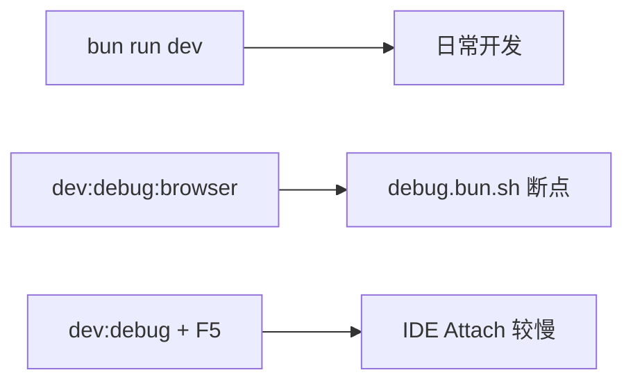

# 内置命令

项目脚本定义在 `server/package.json`（后端）和 `admin/package.json`（前端）。下文 **未特别说明时，均在 `server/` 目录执行**。

## 命令速查

### 后端 server/

| 命令 | 作用 |
|------|------|
| `bun run dev` | 开发：仅 HTTP 主进程（watch） |
| `bun run dev:workers` | 开发：构建 Processor 后启动 Worker |
| `bun run dev:all` | 开发：主进程 + Worker 同时启动 |
| `bun run dev:debug` | 调试：inspect 6499，供 IDE Attach |
| `bun run dev:debug:browser` | 调试：推荐，配合 debug.bun.sh |
| `bun run dev:debug:watch` | 调试 + 热重载（易卡顿，慎用） |
| `bun run build` | 生产构建（主进程 + Worker + Processor） |
| `bun run build:processors` | 仅重建队列 Processor |
| `bun run test` | 单元测试 |
| `bun run test:watch` | 测试 watch 模式 |
| `bun run test:coverage` | 测试 + 覆盖率 |
| `bun run create:module` | 脚手架：后端 CRUD 模块 |
| `bun run create:page` | 脚手架：前端 CRUD 页面 |
| `bun run db:push` | Schema 推送到数据库 |
| `bun run db:pull` | 从数据库拉取 Schema |
| `bun run docker:build` | 构建 Docker 镜像 |
| `bun run docker:run` | 运行容器 |
| `bun run docker:stop` / `docker:rm` / `docker:logs` | 容器管理 |

### 前端 admin/

| 命令 | 作用 |
|------|------|
| `pnpm dev` | Vite 开发服务器（默认 3006） |
| `pnpm build` | 生产构建 → `admin/dist/` |
| `pnpm serve` | 预览构建结果 |

## 开发启动

### dev

只启动 HTTP 主进程，改代码自动重载。日常写接口用这个即可。

```bash
cd server
bun run dev
```

### dev:workers

先执行 `build:processors`，再启动 Worker 进程消费队列、跑定时任务。只用接口、不碰队列时可以不开。

```bash
bun run dev:workers
```

### dev:all

主进程和 Worker 一起启，日志带 `[server]` / `[workers]` 前缀，`Ctrl+C` 同时退出。全栈联调、测队列时推荐。

```bash
bun run dev:all
```

指定 `NODE_ENV`（一般不必，默认 development）：

::: code-group
```bash [windows]
$env:NODE_ENV="development"; bun run dev:all
```

```bash [linux]
NODE_ENV=development bun run dev:all
```

```bash [macos]
NODE_ENV=development bun run dev:all
```
:::

使用队列或定时任务时，至少保证 Worker 在跑。详见 [队列](/guide/queue)。

## 调试

日常开发用 `bun run dev`；需要断点再用下面命令。

| 场景 | 命令 |
|------|------|
| 正常开发 | `bun run dev` |
| 浏览器断点（推荐） | `bun run dev:debug:browser` + [debug.bun.sh](https://debug.bun.sh) |
| Cursor / VS Code Attach | `bun run dev:debug`，F5 连 6499 端口 |



### dev:debug

`--inspect=6499` 启动，不含 watch。配合 VS Code 任务 `Server: dev:debug` 或 launch **Debug Server (IDE, 较慢)**。

```bash
cd server
bun run dev:debug
```

### dev:debug:browser

Bun 官方推荐的调试方式，比 IDE Attach 流畅。启动后把终端里的 `https://debug.bun.sh/#localhost:6499/...` 复制到浏览器，在 Sources 里下断点。

```bash
bun run dev:debug:browser
```

也可通过 **Terminal → Run Task → Server: dev:debug (browser, 推荐)** 启动。

### dev:debug:watch

同时开 inspect 和 watch，调试时容易卡顿或反复重连，仅在「边改代码边调试」时用。

**使用方式：**
```bash [bun]
cd server
bun run dev:debug:watch
```

服务已手动启动时，可用 **Attach Server (6499)** 配置连接。

## 构建

### build

生产环境完整构建：主进程、Worker、所有 Processor、静态资源、`production.yaml`、`ecosystem.config.cjs`。

::: code-group
```bash [windows]
$env:NODE_ENV="production"; bun run build
```

```bash [linux]
NODE_ENV=production bun run build
```

```bash [macos]
NODE_ENV=production bun run build
```
:::

产物目录 `dist/`：

```
dist/
├── index.js              # HTTP 主进程
├── workers.js            # Worker 进程
├── ecosystem.config.cjs  # PM2 配置
├── production.yaml       # 生产配置（部署前请修改）
├── public/               # 前端静态资源（若已复制 admin 构建产物）
├── dist/cjs/             # BullMQ 沙箱 bootstrap
└── processors/
    ├── system-cron.js
    ├── flow-buffer.js
    └── trade-order.js
```

部署说明见 [部署](/guide/deploy)。

### build:processors

只重建 `processors/*.js` 和 `dist/cjs/`。改了 `processor.ts` 或 `worker-sandbox/*.ts` 后执行，再重启 Worker。

```bash
bun run build:processors
```

## 测试

测试在 `server/test/`，`test/preload.ts` 会把配置指向 `development.yaml`（`bun test` 默认 `NODE_ENV=test`，否则会找不存在的 `test.yaml`）。

当前覆盖：纯函数、校验、树结构、时间、`CreateQueryBuilder` 等；**不含** handle 层、真实 DB/Redis、网络请求。

```bash
cd server
bun run test
bun run test:watch
bun run test:coverage
```

## 模块脚手架

在 **`server/`** 执行。依赖 `server/database/schema/` 里**已存在**的 Drizzle 表；字典、菜单、handoff SQL 仍需人工或 AI 补充。完整流程见 [AI 开发指南](/guide/ai-guide)。

### create:module

生成 `server/src/modules/{group}-{name}/` 下的 `route.ts`、`dto.ts`、`handle.ts`。

```bash
cd server
bun run create:module business-goods --tag 商品管理
```

| 参数 | 说明 |
|------|------|
| `--tag` | 模块中文名（API 文档分组） |
| `--schema business_goods` | 指定 schema 文件名，默认由 slug 推导 |
| `--dry-run` | 仅预览，不写文件 |

### create:page

生成前端 CRUD 五件套到 `admin/`（types、api、views）。脚本仍在 server 侧运行。

```bash
bun run create:page business goods --tag 商品管理
```

参数与 `create:module` 相同。`business goods` 对应路由目录 `admin/src/views/business/goods/`。

### 推荐流程

```bash
cd server
bun run create:module business-goods --tag 商品管理
bun run create:page business goods --tag 商品管理
# 再用 AI 补业务校验、字典、菜单与 server/database/sql/business-goods-init.sql
```

## 数据库

**仅建议在开发环境使用。**

```bash
# 将本地 schema 推送到 PostgreSQL
bun run db:push

# 从数据库拉取结构到本地 schema
bun run db:pull
```

表结构说明见 [数据库设计](./database)。业务查询写法见 [数据库操作](/guide/database-operation)。

## Docker

在 `server/` 目录，用于容器化部署 HTTP 主进程（队列 Worker 需另起或改用 PM2）。

```bash
bun run docker:build    # 构建镜像 hnq1/elysia-admin:latest
bun run docker:run      # 启动容器，映射 3000
bun run docker:stop     # 停止
bun run docker:rm       # 删除容器
bun run docker:logs     # 查看日志
```

Compose 多服务示例见 [部署](/guide/deploy)。

## 工作区任务

打开 `elysia-admin.code-workspace` 后，**Terminal → Run Task** 常用项：

| 任务 | 说明 |
|------|------|
| `Dev: Full Stack` | 前后端一起启 |
| `Server: dev` | 仅后端 |
| `Admin: dev` | 仅前端 |
| `Server: dev:debug (browser, 推荐)` | 浏览器调试 |
| `Server: dev:debug` | IDE 调试 |