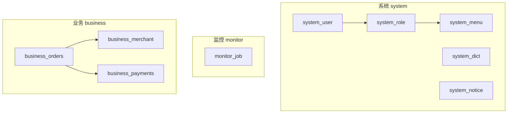
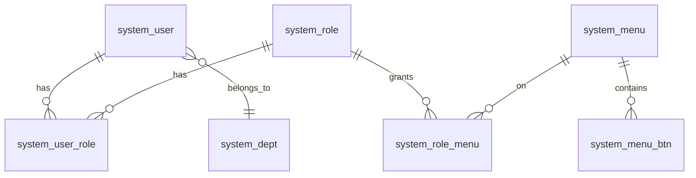
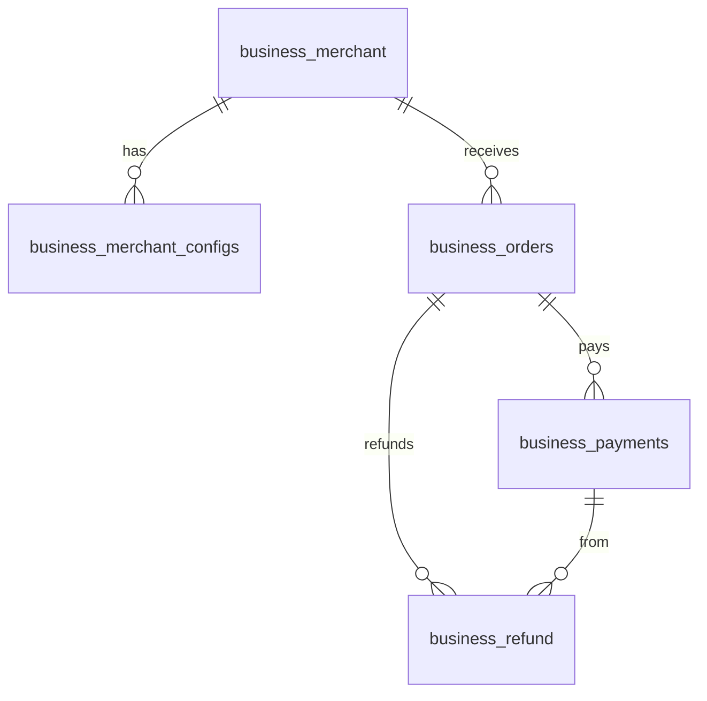

# 数据库设计

本文介绍 Elysia Admin 的 PostgreSQL 表结构设计。Schema 源码在 `server/database/schema/`，以 Drizzle 定义为准；本文便于快速查阅表职责、字段含义和表间关系。

日常 CRUD 与查询写法见 [数据库操作](/guide/database-operation)；新建业务表规范可参考 `.ai/AI_SCHEMA_GUIDE.md`。

## 技术栈

| 组件 | 选型 |
|------|------|
| 数据库 | PostgreSQL >= 16 |
| ORM | [Drizzle ORM](https://orm.drizzle.team/) |
| 数据库驱动 | [postgres](https://github.com/porsager/postgres)（轻量级 PG 驱动） |
| 缓存 | Redis >= 6（[Ioredis](https://ioredis.org/)，会话、缓存与队列共用） |
| 迁移 | Drizzle Kit（`bun run db:push` / `db:pull`，见下方常用命令） |

## 设计原则

- **BaseSchema**：业务表统一继承基础审计字段（创建/更新人、时间、软删、备注）
- **软删除**：`delFlag = true` 标记删除，查询时默认过滤
- **主键**：系统用户用 UUID；其余多数表用 `bigserial` 自增
- **外键**：Drizzle schema 中声明 `references`，保证引用完整性
- **命名**：字段驼峰（代码侧）对应数据库下划线列名
- **状态**：启用/禁用常用 `boolean` 的 `status`；业务流程状态常用 `varchar` + 字典

## BaseSchema

所有业务表通过 `...BaseSchema` 展开以下字段（定义见 `server/database/base-schema.ts`）：

| 字段 | 类型 | 说明 | 默认 |
|------|------|------|------|
| createTime | timestamp | 创建时间 | now() |
| createBy | varchar(36) | 创建人 ID（UUID 字符串） | null |
| updateTime | timestamp | 更新时间 | null |
| updateBy | varchar(36) | 更新人 ID | null |
| delFlag | boolean | 软删除标志 | false |
| remark | varchar(255) | 备注 | null |

下文各表字段表**不含** BaseSchema 重复列，实际表结构均包含上述字段。

## 模块总览



| 模块 | 表数量 | 主要职责 |
|------|--------|----------|
| 系统管理 | 15 | RBAC、字典、日志、存储、IP 黑名单、通知公告 |
| 监控管理 | 1 | 定时任务配置 |
| 业务管理 | 5 | 商户、订单、支付、退款 |

## 系统管理

### system_user 用户表

存储后台账号。主键 `userId` 为 UUID。

| 字段 | 类型 | 约束 | 说明 |
|------|------|------|------|
| userId | uuid | PK | 用户 ID |
| username | varchar(64) | NOT NULL, UNIQUE | 登录名 |
| password | varchar(255) | NOT NULL | 密码（加密） |
| nickname | varchar(64) | | 昵称 |
| email | varchar(64) | | 邮箱 |
| phone | varchar(11) | | 手机 |
| sex | varchar(1) | | 0 未知 / 1 男 / 2 女 |
| avatar | varchar(255) | | 头像 URL |
| deptId | bigint | FK | 部门 ID |
| status | boolean | | 启用 / 禁用 |

关联：多对一 `system_dept`；多对多 `system_role`（经 `system_user_role`）。

### system_role 角色表

| 字段 | 类型 | 约束 | 说明 |
|------|------|------|------|
| roleId | bigserial | PK | 角色 ID |
| roleName | varchar(64) | NOT NULL | 角色名称 |
| roleCode | varchar(64) | NOT NULL | 角色编码 |
| sort | integer | | 排序 |
| status | boolean | | 状态 |

关联：多对多用户、菜单（经关联表）。

### system_user_role 用户角色关联

| 字段 | 类型 | 约束 | 说明 |
|------|------|------|------|
| userId | uuid | FK | 用户 ID |
| roleId | bigint | FK | 角色 ID |

### system_menu 菜单表

树形菜单与前端路由配置，支持外链、iframe、KeepAlive、固定标签等。

| 字段 | 类型 | 说明 |
|------|------|------|
| menuId | bigserial PK | 菜单 ID |
| path / name / component | varchar | 路由路径、名称、组件 |
| title / icon | varchar | 标题、图标 |
| showBadge / showTextBadge | | 徽章 |
| isHide / isHideTab | boolean | 隐藏菜单 / 标签 |
| link / isIframe / isFullPage | | 外链、内嵌、全屏 |
| keepAlive / fixedTab / activePath | | 缓存、固定标签、激活路径 |
| sort / status / parentId | | 排序、状态、父级 |

### system_menu_btn 菜单按钮

| 字段 | 类型 | 说明 |
|------|------|------|
| btnId | bigserial PK | 按钮 ID |
| menuId | bigint FK | 所属菜单 |
| title | varchar | 按钮名 |
| permission | varchar | 权限标识，如 `system:user:create` |
| sort / status | | 排序、状态 |

### system_role_menu 角色菜单关联

| 字段 | 类型 | 说明 |
|------|------|------|
| roleId | bigint FK | 角色 |
| menuId | bigint FK | 菜单 |
| menuBtnId | bigint FK | 按钮（可选） |

### RBAC 关系图

用户通过角色获得菜单与按钮权限：



### system_dept 部门表

树形组织架构，`parentId` 自关联。

| 字段 | 类型 | 说明 |
|------|------|------|
| deptId | bigserial PK | 部门 ID |
| deptName | varchar(64) | 部门名称 |
| parentId | bigint | 父部门 |
| sort / status | | 排序、状态 |

### system_api 接口表

记录 API 路径与方法，用于权限与文档。

| 字段 | 类型 | 说明 |
|------|------|------|
| apiId | bigserial PK | API ID |
| apiName | varchar(64) | 名称 |
| apiPath | varchar(255) | 路径 |
| apiMethod | varchar(10) | GET / POST 等 |
| status | boolean | 状态 |

### system_dict_type / system_dict_data 字典

类型表定义 `dictType`，数据表存 label/value，前端 `useDictStore` 读取。

**system_dict_type**

| 字段 | 说明 |
|------|------|
| dictId | PK |
| dictName / dictType | 名称、类型编码（唯一） |
| status | 状态 |

**system_dict_data**

| 字段 | 说明 |
|------|------|
| dictCode | PK |
| dictType | 关联类型 |
| dictLabel / dictValue | 显示文本、实际值 |
| dictSort | 排序 |
| tagType / customClass | 标签样式 |
| status | 状态 |

### system_login_log 登录日志

| 字段 | 说明 |
|------|------|
| logId | PK |
| loginType / loginName | 登录方式、用户名 |
| clientType / clientPlatform | 客户端 |
| ipaddr / loginLocation | IP、地理位置 |
| userAgent / os | UA、系统 |
| message / status | 提示、成功与否 |

### system_oper_log 操作日志

中间件 `AddOperLog` 写入，路由 `meta.isLog: true` 时记录。

| 字段 | 说明 |
|------|------|
| operId | PK |
| title / action | 模块、操作名 |
| requestMethod | HTTP 方法 |
| userId / operName | 操作人 |
| operUrl / operIp / operLocation | URL、IP、地点 |
| operParam / jsonResult | 请求参数、响应摘要 |
| costTime | 耗时（ms） |
| status | 是否成功 |

### system_ip_black IP 黑名单

| 字段 | 说明 |
|------|------|
| ipBlackId | PK |
| ipAddress | IP（唯一） |
| status | 是否生效 |

### system_storage 存储配置

对象存储（OSS / COS / S3 / RustFS 等）连接信息，详见 [文件存储](/guide/storage)。

| 字段 | 说明 |
|------|------|
| storageId | PK |
| name | 配置名称（唯一） |
| region / endpoint / bucket | 区域、端点、桶 |
| accessKey / secretKey | 密钥 |
| status | 是否启用（同时仅一条可为 true） |

### system_notice 通知公告

后台「系统管理 → 通知公告」维护的系统公告，内容存 HTML（富文本编辑器）。

| 字段 | 说明 |
|------|------|
| noticeId | PK |
| title | 公告标题 |
| noticeType | 通知类型，字典 `system_notice_type` |
| content | 公告正文（HTML） |
| status | 发布状态（启用 / 停用） |
| sort | 排序 |

Handoff SQL：`server/database/sql/system-notice-init.sql`（菜单与按钮权限）。

## 监控管理

### monitor_job 定时任务

与 `system-cron-queue`、后台「定时任务」页配合。`jobName` 须与 `worker-sandbox` 注册名一致。

| 字段 | 类型 | 说明 |
|------|------|------|
| jobId | bigserial PK | 任务 ID |
| jobName | varchar(64) UNIQUE | 任务名称 |
| jobCron | varchar(64) | Cron 表达式 |
| jobArgs | varchar(256) | JSON 数组参数 |
| status | boolean | 是否启用 |

详见 [定时任务](/guide/cron)。

## 业务管理

支付示例模块：商户 → 订单 → 支付流水 → 退款。



### business_merchant 商户表

| 字段 | 类型 | 说明 |
|------|------|------|
| id | bigserial PK | 商户 ID |
| name | varchar(100) | 商户名称 |
| status | boolean | 状态 |

### business_merchant_configs 商户支付配置

一条记录对应一个商户的一种支付渠道，供 `Pay(channel, platform)` 使用。

| 字段 | 类型 | 说明 |
|------|------|------|
| id | bigserial PK | 配置 ID |
| merchantId | bigint FK | 商户 |
| channel | varchar(20) | alipay / wechat / paypal |
| appId / mchId | varchar | 应用 ID、微信商户号 |
| privateKey / publicKey | text | 密钥 PEM |
| config | jsonb | notifyUrl、apiV3Key 等扩展 |
| status | boolean | 是否启用 |

详见 [支付集成](/guide/payment)。

### business_orders 订单表

| 字段 | 类型 | 说明 |
|------|------|------|
| id | bigserial PK | 订单 ID |
| orderNo | varchar(64) UNIQUE | 订单号 |
| userId | varchar(64) | 下单用户（UUID 字符串） |
| merchantId | bigint FK | 商户 |
| title / description | varchar | 标题、描述 |
| amount | decimal(10,2) | 金额 |
| currency | varchar(10) | 默认 CNY |
| status | varchar(20) | 字典 `system_orders_status` |
| expireTime | timestamp | 过期时间 |
| extra | jsonb | 商品列表等扩展 |

订单状态（字典 `system_orders_status`）：

| 值 | 含义 |
|----|------|
| 0 | 待支付 |
| 1 | 已支付 |
| 2 | 已取消 |
| 3 | 已过期 |
| 4 | 已退款 |

### business_payments 支付流水

| 字段 | 类型 | 说明 |
|------|------|------|
| id | bigserial PK | 支付 ID |
| orderId | bigint FK | 订单 ID |
| orderNo | varchar(64) UNIQUE FK | 订单号 |
| merchantConfigId | bigint FK | 商户配置 |
| paymentNo | varchar(64) UNIQUE | 本地支付单号 |
| platform | varchar(20) | 终端：app / h5 / mini / pc |
| paymentMethod | varchar(20) | 渠道：alipay / wechat / paypal |
| amount | decimal(10,2) | 实付金额 |
| status | varchar(20) | 字典 `system_pay_status` |
| thirdTradeNo | varchar(100) | 第三方交易号 |
| extra | jsonb | 回调原始数据等 |

支付状态（`system_pay_status`）：0 待支付、1 成功、2 失败、3 已关闭。

### business_refund 退款表

| 字段 | 类型 | 说明 |
|------|------|------|
| id | bigserial PK | 退款 ID |
| orderId | bigint FK | 订单 |
| paymentId | bigint FK | 支付流水 |
| refundNo | varchar(64) UNIQUE | 退款单号 |
| amount | decimal(10,2) | 退款金额 |
| status | varchar(20) | 字典 `system_refund_status` |
| thirdRefundNo | varchar(100) | 第三方退款号 |
| extra | jsonb | 扩展 |

退款状态：0 退款中、1 成功、2 失败。

## 索引建议

常用查询字段建议加索引（列名为数据库下划线形式）：

```sql
-- 用户
CREATE INDEX idx_user_username ON system_user(username);
CREATE INDEX idx_user_dept ON system_user(dept_id);
CREATE INDEX idx_user_status ON system_user(status);

-- 菜单
CREATE INDEX idx_menu_parent ON system_menu(parent_id);
CREATE INDEX idx_menu_status ON system_menu(status);

-- 订单
CREATE INDEX idx_order_no ON business_orders(order_no);
CREATE INDEX idx_order_user ON business_orders(user_id);
CREATE INDEX idx_order_merchant ON business_orders(merchant_id);
CREATE INDEX idx_order_status ON business_orders(status);
CREATE INDEX idx_order_create_time ON business_orders(create_time);

-- 支付
CREATE INDEX idx_payment_order ON business_payments(order_id);
CREATE INDEX idx_payment_no ON business_payments(payment_no);
CREATE INDEX idx_payment_third_trade ON business_payments(third_trade_no);

-- 日志
CREATE INDEX idx_login_log_time ON system_login_log(create_time);
CREATE INDEX idx_oper_log_time ON system_oper_log(create_time);
CREATE INDEX idx_oper_log_user ON system_oper_log(user_id);
```

Drizzle `db:push` 不会自动创建上述索引，可按需在 schema 或迁移 SQL 中补充。

## 常用命令

在 `server/` 目录执行：

```bash
# 将 schema 推送到数据库（开发常用）
bun run db:push

# 从数据库拉取结构到本地 schema
bun run db:pull
```

使用 Drizzle Kit 迁移工作流时：

```bash
bun drizzle-kit generate
bun drizzle-kit migrate
```

初始化 SQL 脚本在 `server/database/sql/`，新模块菜单权限可合并进 `{模块}-init.sql` 手动执行。

## 性能建议

- 列表查询走 `FindPage` + `CreateQueryBuilder`，避免一次拉全表
- 热点字典、配置用 Redis `WithCache`，见 [缓存](/guide/cache)
- 日志表定期归档或清理
- 联表查询注意 N+1，优先 `FindPageWithJoin` 或批量查询
- 连接池大小按并发调优，勿过大占满数据库连接

## 相关文档

- [数据库操作](/guide/database-operation)
- [缓存](/guide/cache)
- [支付集成](/guide/payment)
- [定时任务](/guide/cron)