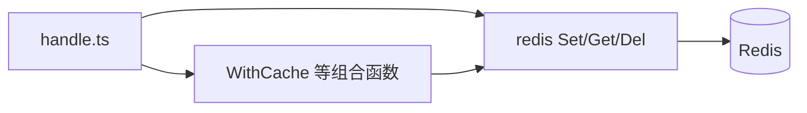
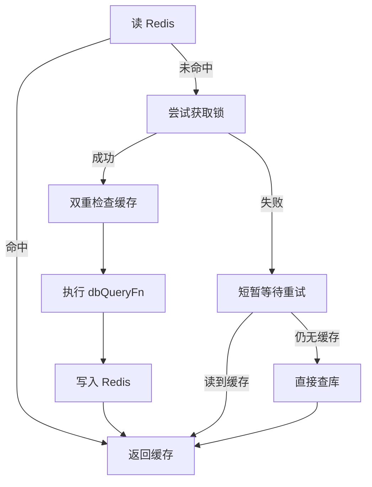

# 缓存操作

项目通过 Redis 做数据缓存，减少重复查库。基础读写走 `@/core/database/redis`，带防击穿和列表增量维护的组合操作走 `@/core/cache`。

缓存键建议用 `CacheEnum`（`@/constants/enum`）统一管理，避免硬编码字符串散落各处。字典、部门树等模块已按此方式使用。



## 基础 API

从 `@/core/database/redis` 导入。值会自动 JSON 序列化 / 反序列化。

| 函数 | 用途 |
|------|------|
| `Set(key, value, expire?)` | 写入缓存，`expire` 为秒；不传则保留已有 TTL |
| `SetMulti(items)` | 批量写入，`items` 为 `{ key, value, expire? }[]` |
| `Get(key)` | 读取，不存在返回 `null` |
| `Del(key \| keys)` | 删除单个或批量 |
| `Keys(pattern)` | 按前缀或通配符查找键 |

```ts
import { Set, Get, Del } from '@/core/database/redis';

await Set('user:1', { name: 'John', age: 30 }, 60);
const user = await Get('user:1');
await Del(['user:1', 'user:2']);
```

```ts
import { SetMulti } from '@/core/database/redis';

await SetMulti([
    { key: 'user:1', value: { name: 'John' }, expire: 60 },
    { key: 'user:2', value: { name: 'Jane' }, expire: 60 },
]);
```

业务数据变更后记得主动 `Del` 相关键。例如字典模块在增删改后会清除 `CacheEnum.DICT_TYPE` 和对应的 `DICT_DATA` 键，避免读到过期数据。

## WithCache

`WithCache` 封装「先读缓存，未命中再查库并回写」的逻辑，并用分布式锁防止热点键过期时大量请求同时穿透到数据库。



```ts [handle.ts]
import { WithCache } from '@/core/cache';
import { CacheEnum } from '@/constants/enum';
import { CreateQueryBuilder, FindAll } from '@/core/database/repository';
import { systemDictTypeSchema } from '@database/schema/system_dict';

const data = await WithCache(
    CacheEnum.DICT_TYPE,
    async () => {
        const where = CreateQueryBuilder(systemDictTypeSchema).eq('delFlag', false).build();
        return await FindAll(systemDictTypeSchema, where);
    },
    300, // 过期秒数，默认取 config.app.baseCacheTime
);
```

| 参数 | 说明 | 默认 |
|------|------|------|
| `cacheKey` | Redis 键 | — |
| `dbQueryFn` | 缓存未命中时执行的查库函数 | — |
| `expire` | 过期时间（秒） | `config.app.baseCacheTime` |
| `lockTtl` | 分布式锁 TTL（秒） | 10 |
| `retryTimes` | 抢锁失败重试次数 | 3 |
| `retryDelay` | 重试间隔（毫秒） | 100 |

获锁方回写缓存后，其他等待的请求会通过双重检查或重试读到新值；重试超时则直接查库兜底。

## 列表缓存维护

`CacheInsert`、`CacheUpdate`、`CacheDelete` 用于在**不整键失效**的前提下，增量维护已缓存的**数组**数据。适合列表类缓存；结构复杂或一致性要求高时，直接 `Del` 后让 `WithCache` 重建更稳妥。

从 `@/core/cache` 导入：

| 函数 | 用途 |
|------|------|
| `CacheInsert(cacheKey, data)` | 向数组末尾追加一项；缓存不存在则新建 `[data]` |
| `CacheUpdate(cacheKey, key, data)` | 按 `key` 字段匹配并合并更新；无匹配项则追加 |
| `CacheDelete(cacheKey, key, values)` | 按 `key` 字段值数组过滤删除；删空则移除整个键 |

```ts
import { CacheInsert, CacheUpdate, CacheDelete } from '@/core/cache';

// 缓存结构: [{ id: 1, name: 'A' }, { id: 2, name: 'B' }]
await CacheInsert('users:list', { id: 3, name: 'New User' });
await CacheUpdate('users:list', 'id', { id: 1, name: 'Updated', age: 25 });
await CacheDelete('users:list', 'id', [1, 2]);
```

三个函数均返回 `boolean` 表示是否操作成功，内部异常会记日志并返回 `false`。

## 使用建议

- 键名走 `CacheEnum`，新增业务缓存时在 `constants/enum` 里补常量
- 写操作后主动失效相关键，不要依赖 TTL 兜底业务一致性
- 高频读、低频写的数据适合 `WithCache`；写多读少的场景慎用列表增量维护
- 后台「系统监控 → 缓存管理」可查看 `CacheEnum` 中注册的缓存键（见 `monitor-cache` 模块）