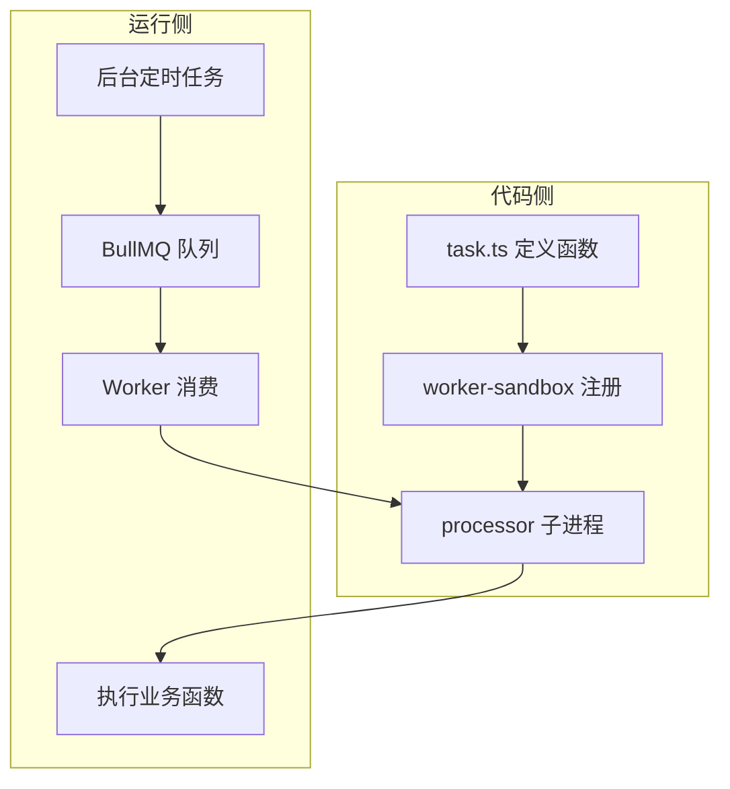

# 定时任务

定时任务用于按 Cron 表达式周期执行业务逻辑，例如清理过期数据、同步外部状态。系统基于 **BullMQ Sandboxed Processors** 实现：每个任务在独立子进程中运行，不会阻塞主进程的 HTTP 事件循环。

整体链路如下。后台配置的任务名、Cron 和参数会写入队列调度；Worker 消费后，经 `worker-sandbox` 注册表找到 `task.ts` 里的函数并执行。



与 [队列](./queue) 里的异步任务共用同一套 Redis 与 Worker 模型，区别只是触发来源：定时任务由 Cron 调度，异步任务由业务代码 `addJob` 投递。

## 任务函数

在业务模块的 `task.ts` 中定义并导出任务函数。参数顺序和类型需与后台配置的「任务参数」一致。

```ts [task.ts]
// server/src/modules/monitor-job/task.ts
import { logger } from '@/shared/logger';

export function jobDemo(name: string, age?: number, isActive?: boolean) {
    logger.info(`jobDemo 执行 - 姓名: ${name}, 年龄: ${age ?? '未提供'}, 状态: ${isActive ? '激活' : '未激活'}`);
}
```

`task.ts` 里写纯函数即可，复杂业务可调用同模块的 `handle.ts`，避免在 processor 里重复逻辑。

## 沙箱注册

任务函数写好后，必须在 `worker-sandbox` 里注册，Worker 子进程才能按名称找到它。

**不要**在 `processor.ts` 里直接 `import '@/modules/...'`，以保持 infrastructure 与 modules 的依赖边界。

```ts [system-cron-tasks.ts]
// server/src/worker-sandbox/system-cron-tasks.ts
import { jobDemo } from '@/modules/monitor-job/task';
import type { TaskFn } from '@/infrastructure/queue/core/processor-utils';

export function registerSystemCronSandboxTasks(
    register: (name: string, fn: TaskFn) => void,
): void {
    // 第一个参数必须与后台「任务名称」完全一致
    register('测试任务', jobDemo);
}
```

`processor.ts` 只负责调用注册函数，不关心具体业务：

```ts [processor.ts]
// server/src/infrastructure/queue/queues/system-cron/processor.ts
import type { SandboxedJob } from 'bullmq';
import { registerSystemCronSandboxTasks } from '@/worker-sandbox/system-cron-tasks';
import { createTaskRegistry, parseArgs } from '../../core/processor-utils';

const { register, get } = createTaskRegistry();
registerSystemCronSandboxTasks(register);

export default async function processor(job: SandboxedJob) {
    const { taskName, jobArgs } = job.data;
    const taskFn = get(taskName);
    if (!taskFn) throw new Error(`[SystemCron] 未找到任务: ${taskName}`);
    await taskFn(...parseArgs(jobArgs));
    return { success: true, taskName };
}
```

Processor 运行在独立子进程中，可以正常使用数据库、Redis 等工具，但无法访问主进程的内存单例。子进程会自行初始化所需连接。

## 构建与启动

修改 `worker-sandbox/*.ts` 或 `processor.ts` 后，需要重新构建 processor 才能生效。

```bash
cd server
bun run build:processors
```

开发环境单独启动 Worker：

```bash
bun run dev:workers
```

前后端和 Worker 一起启动时，可用 `bun run dev:all`。

## 后台配置

代码注册完成后，在后台添加调度配置。路径：**系统监控 → 定时任务**。


| 字段 | 说明 |
|------|------|
| 任务名称 | 与 `register('测试任务', ...)` 的第一个参数**完全一致**，全局唯一 |
| Cron 表达式 | 执行频率，可用 [在线工具](https://tool.lu/crontab/) 校验 |
| 任务参数 | JSON 数组，如 `["张三", 25, true]`，顺序和类型对应函数参数 |

提交后把任务状态设为「开启」，系统会按 Cron 表达式自动触发。

## 部署注意

至少需要一个 Worker 进程在运行，否则任务只会积压在 Redis 中，不会被消费。生产环境通常用 PM2 单独管理 Worker，与 HTTP 服务分开部署。

多实例部署时，BullMQ 通过 Redis 保证同一触发时刻只有一个 Worker 消费任务，一般不需要额外的分布式锁。Worker 崩溃后由进程管理器重启；未完成的任务数据持久化在 Redis 中，重启后可恢复。