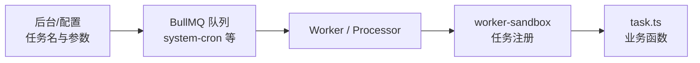

# 定时任务

本章将详细介绍如何在系统中创建、配置并运行一个定时任务（Cron Job）。

系统基于 **BullMQ Sandboxed Processors** 实现定时任务，每个任务在独立子进程中执行，不会阻塞主进程事件循环。

## 一、创建任务函数

在对应模块的 `task.ts` 中定义任务函数并导出：

```ts [task.ts]
// src/modules/monitor-job/task.ts
import { logger } from "@/shared/logger";

/**
 * 示例任务函数
 * 参数顺序和类型需与后台配置的"任务参数"保持一致
 */
export function jobDemo(name: string, age?: number, isActive?: boolean) {
    logger.info(`jobDemo 执行 - 姓名: ${name}, 年龄: ${age || '未提供'}, 状态: ${isActive ? '激活' : '未激活'}`);
}
```

## 二、在 worker-sandbox 中注册任务

在 `server/src/worker-sandbox/system-cron-tasks.ts` 中 import 模块 `task.ts` 并注册（**勿在** `processor.ts` 内直接 `import '@/modules/...'`，以保持 infrastructure 与 modules 的依赖边界）：

```ts [system-cron-tasks.ts]
// server/src/worker-sandbox/system-cron-tasks.ts
import { jobDemo } from '@/modules/monitor-job/task';
import type { TaskFn } from '@/infrastructure/queue/core/processor-utils';

export function registerSystemCronSandboxTasks(
    register: (name: string, fn: TaskFn) => void,
): void {
    // 任务名称必须与后台配置的「任务名称」完全一致
    register('测试任务', jobDemo);
}
```

`processor.ts` 仅负责调用沙箱注册函数：

```ts [processor.ts]
// server/src/infrastructure/queue/queues/system-cron/processor.ts
import type { SandboxedJob } from 'bullmq';
import { registerSystemCronSandboxTasks } from '@/worker-sandbox/system-cron-tasks';
import { createTaskRegistry, parseArgs } from '../../core/processor-utils';

const { register, get } = createTaskRegistry();
registerSystemCronSandboxTasks(register);

export default async function processor(job: SandboxedJob) {
    const { taskName, jobArgs } = job.data;
    const taskFn = get(taskName);
    if (!taskFn) throw new Error(`[SystemCron] 未找到任务: ${taskName}`);
    await taskFn(...parseArgs(jobArgs));
    return { success: true, taskName };
}
```

> Processor 运行在独立子进程中，可以正常使用数据库、Redis 等所有工具，但无法访问主进程的内存单例（如已建立的连接对象）。子进程会自行初始化所需的连接。

## 三、重新构建 Processor

每次修改 `worker-sandbox/*.ts` 或 `processor.ts` 后，需要重新构建才能生效：

```bash [bun]
bun run build:processors
```

开发环境重启 Worker 进程：

```bash [bun]
bun run dev:workers
```

## 四、后台管理配置

完成代码注册后，前往后台管理系统添加调度配置。

### 1. 添加任务数据

访问路径：`系统监控` -> `定时任务`。


### 2. 表单字段说明

- 任务名称：**关键字段**。必须与 `worker-sandbox` 中 `register()` 的第一个参数完全一致，且全局唯一。
- Cron 表达式：定义任务的执行频率。建议使用 [Cron 表达式在线生成工具](https://tool.lu/crontab/) 进行校验。
- 任务参数：
  - 使用 JSON 数组格式（例如：`["张三", 25, true]`）。
  - 参数顺序及类型必须与任务函数的参数定义一一对应。

### 3. 启用任务

提交表单后，确保任务状态设置为"开启"，系统将根据 Cron 表达式自动触发执行。

## 五、整体串联

完成以上四步后，整个定时任务的运转链路如下：

后台（或种子数据）里配置的「任务名称、Cron 表达式、参数」会转化为对 BullMQ 队列的调度；Worker 进程消费队列后，经 `worker-sandbox` 注册表根据任务名分发到 `task.ts` 中的业务函数。这与手动 `addJob` 的异步任务共用同一套 Redis 与 Worker 模型，只是触发来源从「业务代码投递」变成了「定时触发」。若需了解进程边界与 Sandboxed Processor，可继续阅读 [队列](./queue.md) 中的架构说明。



实际部署时还需保障 **至少有一个 Worker 进程** 在跑，否则上图中的队列只会积压在 Redis 中无法被消费。

## 六、多实例与高可用

系统基于 **BullMQ** 的分布式队列机制，天然支持多实例部署：

- BullMQ 通过 Redis 保证同一任务在同一触发时间只被一个 Worker 消费，无需额外的分布式锁。
- Worker 进程崩溃后由 PM2 自动重启，不影响主进程（HTTP 服务）。
- 任务数据持久化在 Redis 中，重启后未完成的任务会自动恢复。