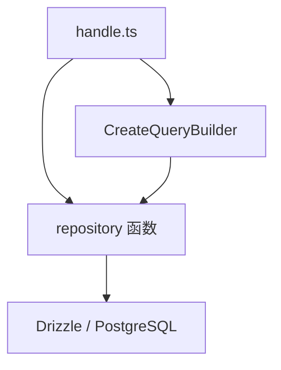

# 数据库操作

业务模块的 `handle.ts` 通过 `@/core/database/repository` 访问 PostgreSQL，底层基于 Drizzle ORM。你一般不需要手写 SQL，用封装好的增删改查和 `CreateQueryBuilder` 即可覆盖大部分场景。

下文示例统一使用 `AppContext`（`import type { AppContext } from '@/types/app-context'`），与中间件注入的 `ctx.body`、`ctx.query`、`ctx.params`、`ctx.user` 一致。接口入参校验见 [参数验证](./parameter-validation)。



## API 速查

所有函数均从 `@/core/database/repository` 导入。

| 函数 | 用途 |
|------|------|
| `InsertOne` | 插入，不返回记录 |
| `InsertOneAndRes` | 插入，返回新记录 |
| `InsertMany` | 批量插入 |
| `FindOneByKey` | 按主键查单条 |
| `FindAll` | 查全部（不分页） |
| `FindPage` | 分页查询 |
| `FindAllWithJoin` | 联表查全部 |
| `FindPageWithJoin` | 联表分页 |
| `UpdateByKey` | 按主键更新，不返回 |
| `UpdateByKeyAndRes` | 按主键更新，返回记录 |
| `SoftDeleteByKeys` | 软删除（`delFlag = true`） |
| `HardDelete` | 按 where 条件硬删除 |
| `HardDeleteByKeys` | 按主键数组硬删除 |
| `CreateQueryBuilder` | 链式构造 where 条件 |

传入 `ctx` 时，封装会自动填充 `createBy` / `updateBy`（表里有对应字段时）。用 `customData` 时把 `ctx` 设为 `null`。

## 插入

```ts [handle.ts]
import type { AppContext } from '@/types/app-context';
import { InsertOneAndRes } from '@/core/database/repository';
import { BaseResultData } from '@/core/result';
import { businessMerchantSchema } from '@database/schema/business_merchant';

export async function create(ctx: AppContext) {
    const res = await InsertOneAndRes(businessMerchantSchema, ctx);
    return BaseResultData.ok(res);
}
```

只需写入、不关心返回值时用 `InsertOne`。批量导入用 `InsertMany(schema, ctx, dataArray)`。

## 查询条件

### QueryBuilder 方法

| 方法 | 说明 | 示例 |
|------|------|------|
| `eq` | 等于 | `eq('status', true)` |
| `ne` | 不等于 | `ne('type', 'x')` |
| `in` / `notIn` | 在 / 不在数组中 | `in('id', [1, 2, 3])` |
| `like` / `ilike` | 模糊匹配（区分 / 不区分大小写） | `like('name', keyword)` |
| `notLike` / `notIlike` | 不包含 | `notLike('name', 'test')` |
| `leftLike` / `rightLike` | 左 / 右模糊 | `rightLike('code', 'A')` |
| `gt` / `gte` / `lt` / `lte` | 比较 | `gte('amount', 0)` |
| `between` / `notBetween` | 区间 | `between('age', 18, 60)` |
| `dateRange` | 日期范围 | `dateRange('createTime', start, end)` |
| `isNull` / `isNotNull` | 空值判断 | `isNull('deletedAt')` |
| `or` / `not` | 组合条件 | `or()` / `not()` |
| `join` | 联表 | 见下文 |
| `custom` | 自定义 SQL 片段 | `custom(sql)` |

值为 `undefined`、`null` 或空字符串时，对应条件会自动跳过，不必手动判断。

### 构造 where

```ts
const where = CreateQueryBuilder(businessMerchantSchema)
    .eq('delFlag', false)
    .eq('status', status)
    .dateRange('createTime', startTime, endTime)
    .build();
```

等价于：

```sql
WHERE del_flag = false
  AND status = $status
  AND create_time BETWEEN $start AND $end
```

## 查询

### 按主键

```ts [handle.ts]
import { FindOneByKey } from '@/core/database/repository';

export async function findOne(ctx: AppContext) {
    const res = await FindOneByKey(businessMerchantSchema, 'id', ctx.params.id);
    return BaseResultData.ok(res);
}
```

### 列表与分页

不分页：

```ts
const where = CreateQueryBuilder(systemDictTypeSchema).eq('delFlag', false).build();
const list = await FindAll(systemDictTypeSchema, where);
```

分页（`pageNum`、`pageSize` 等通常来自 `ctx.query`，与 `BaseListQueryDto` 对齐）：

```ts [handle.ts]
import { CreateQueryBuilder, FindPage } from '@/core/database/repository';

export async function findList(ctx: AppContext) {
    const { pageNum = 1, pageSize = 10, orderByColumn = 'createTime', sortRule = 'desc', startTime, endTime, status } = ctx.query;
    const where = CreateQueryBuilder(businessMerchantSchema)
        .eq('delFlag', false)
        .eq('status', status)
        .dateRange('createTime', startTime, endTime)
        .build();
    const res = await FindPage(businessMerchantSchema, where, { pageNum, pageSize, orderByColumn, sortRule });
    return BaseResultData.ok(res);
}
```

返回的 `res` 结构为 `{ list, total }`。

### 联表查询

通过 `.join()` 把关联表数据挂到主表字段上，再用 `FindAllWithJoin` 或 `FindPageWithJoin` 查询。

```ts [handle.ts]
import { eq } from 'drizzle-orm';
import { CreateQueryBuilder, FindAllWithJoin } from '@/core/database/repository';
import { ListToTree } from '@/shared/tree';
import { systemMenuSchema } from '@database/schema/system_menu';
import { systemMenuBtnSchema } from '@database/schema/system_menu_btn';

export async function findTree(ctx: AppContext) {
    const builder = CreateQueryBuilder(systemMenuSchema)
        .eq('delFlag', false)
        .join({
            joinSchema: systemMenuBtnSchema,
            fieldName: 'authList',
            foreignKey: 'menuId',
            primaryKey: 'menuId',
            defaultValue: [],
            where: eq(systemMenuBtnSchema.delFlag, false),
            multiple: true,
        });
    const data = await FindAllWithJoin(systemMenuSchema, builder);
    const tree = ListToTree(data, {
        idKey: 'menuId',
        parentKey: 'parentId',
        childrenKey: 'children',
        rootValue: 0,
        sortKey: 'sort',
    });
    return BaseResultData.ok(tree);
}
```

联表分页与上面类似，把 `FindAllWithJoin` 换成 `FindPageWithJoin`，并传入分页参数。

`join` 常用字段：

| 字段 | 说明 |
|------|------|
| `joinSchema` | 关联表 schema |
| `fieldName` | 挂到主表记录上的属性名 |
| `foreignKey` / `primaryKey` | 关联键 |
| `multiple` | `true` 为一对多，`false` 为一对一 |
| `where` | 关联表的额外过滤 |
| `defaultValue` | 无关联数据时的默认值 |

## 更新

```ts [handle.ts]
import { UpdateByKeyAndRes } from '@/core/database/repository';
import { systemDeptSchema } from '@database/schema/system_dept';

export async function update(ctx: AppContext) {
    const res = await UpdateByKeyAndRes(systemDeptSchema, 'deptId', ctx);
    return BaseResultData.ok(res);
}
```

传入 `ctx` 时，`ctx.body` 中的主键用于定位记录，其余字段写入更新；`updateTime` 和 `updateBy` 会自动处理。日期字符串经 `ParseDateFields` 转为 `Date`（见 [参数验证](./parameter-validation.md)）。

## 删除

业务表默认用软删除，关联表、中间表常用硬删除。

**软删除** — 将 `delFlag` 标为 `true`，`ctx.params.ids` 为主键列表（路由通常为 `/:ids`）：

```ts [handle.ts]
import { SoftDeleteByKeys } from '@/core/database/repository';

export async function remove(ctx: AppContext) {
    await SoftDeleteByKeys(systemApiSchema, 'apiId', ctx);
    return BaseResultData.ok();
}
```

**硬删除** — 物理移除记录：

```ts
import { eq } from 'drizzle-orm';
import { HardDelete, HardDeleteByKeys } from '@/core/database/repository';

// 按条件
await HardDelete(systemRoleMenuSchema, eq(systemRoleMenuSchema.roleId, roleId));

// 按主键数组
await HardDeleteByKeys(systemRoleMenuSchema, 'roleId', [1, 2, 3]);
```

## 事务

多表写入需要原子性时，用 `@/core/database/transaction`。事务内抛出错误会自动回滚。

### RunTransaction

最常用的写法。回调参数 `tx` 与 Drizzle 事务对象一致，可直接 `insert` / `update` / `select`。

```ts
import { RunTransaction } from '@/core/database/transaction';
import { systemUserSchema } from '@database/schema/system_user';
import { systemRoleSchema } from '@database/schema/system_role';

const result = await RunTransaction(async (tx) => {
    const user = await tx.insert(systemUserSchema).values({
        userName: 'admin',
        nickName: 'Administrator',
    }).returning();

    const role = await tx.insert(systemRoleSchema).values({
        roleName: 'admin',
        roleKey: 'admin',
        roleSort: 1,
    }).returning();

    return { user: user[0], role: role[0] };
});
```

### 隔离级别与只读

第二个参数可传配置：

```ts
// 隔离级别：read uncommitted | read committed | repeatable read | serializable
await RunTransaction(async (tx) => { /* ... */ }, { isolationLevel: 'serializable' });

// 只读事务
await RunTransaction(async (tx) => {
    return await tx.select().from(systemUserSchema);
}, { accessMode: 'read only' });
```

### 构建器与钩子

需要链式配置隔离级别、只读模式或生命周期钩子时，用 `CreateTransaction`：

```ts
import { CreateTransaction } from '@/core/database/transaction';

const result = await CreateTransaction<{ userId: number }>()
    .isolation('serializable')
    .readOnly()
    .onBegin(() => console.log('事务开始'))
    .onCommit(() => console.log('提交成功'))
    .onRollback((err) => console.error('已回滚', err))
    .execute(async (tx) => {
        const user = await tx.insert(systemUserSchema).values({ userName: 'builder' }).returning();
        return { userId: user[0].userId };
    })
    .run();
```

`RunTransaction` 也支持 `onBegin`、`onCommit`、`onRollback`、`onError` 钩子，适合提交后清缓存、回滚时记日志等场景。

### 批量与嵌套

`CreateBatchTransaction` 可串行或并行跑多个**独立**事务：

```ts
import { CreateBatchTransaction } from '@/core/database/transaction';

const results = await CreateBatchTransaction()
    .add('创建用户', async (tx) => tx.insert(systemUserSchema).values({ userName: 'u1' }).returning())
    .add('创建角色', async (tx) => tx.insert(systemRoleSchema).values({ roleName: 'r1' }).returning())
    .runAll();        // 串行
    // .runAllParallel()  // 并行，互不影响
```

可复用函数用 `WithTransaction`，传入已有 `tx` 时加入同一事务，否则自动开新事务：

```ts
import { WithTransaction, TransactionContext } from '@/core/database/transaction';
import pg from '@/core/database/pg';

async function createUser(name: string, tx?: TransactionContext) {
    return WithTransaction(tx ?? pg, async (t) => {
        return t.insert(systemUserSchema).values({ userName: name }).returning();
    });
}

async function createRole(name: string, tx?: TransactionContext) {
    return WithTransaction(tx ?? pg, async (t) => {
        return t.insert(systemRoleSchema).values({ roleName: name }).returning();
    });
}

// 共享同一事务
await RunTransaction(async (tx) => {
    await createUser('john', tx);
    await createRole('admin', tx);
});

// 各自独立事务
await createUser('jane');
```

## 参考

- [Drizzle ORM 事务](https://orm.drizzle.org.cn/docs/transactions)
- [PostgreSQL 事务](https://www.runoob.com/postgresql/postgresql-transaction.html)
