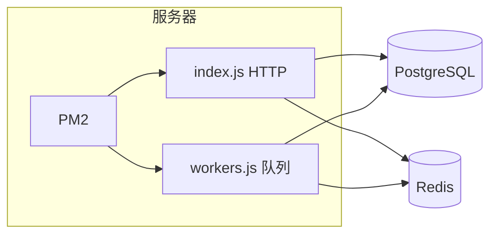

# 部署

生产环境需要 PostgreSQL、Redis，以及（若使用队列/定时任务）独立运行的 Worker 进程。本文介绍 Docker 与 PM2 两种常见方式，以及宝塔面板上的操作要点。



## 部署前准备

无论哪种方式，上线前请先改好配置。

**后端** — 编辑 `server/src/config/production.yaml`：

| 配置项 | 说明 |
|--------|------|
| `app.port` / `app.prefix` | 服务端口与 API 前缀（默认 `/api`） |
| `app.corsOrigin` | 前端访问域名，生产环境务必改成你的域名 |
| `database.*` | PostgreSQL 连接信息 |
| `redis.*` | Redis 连接信息 |
| `jwt.*.secret` | 生产环境请换成随机强密钥 |

**前端（前后端同机部署时）**

在 `admin/` 配置 `.env.production` 的 `VITE_API_BASE_URL`，构建后把产物放进 `server/public/`：

```bash
cd admin
pnpm install
pnpm build
# 将 admin/dist/ 内文件复制到 server/public/
```

然后执行 `server` 的 `bun run build`，`public/` 会一并打进 `dist/public/`。

**前端（前后端分离时）**

`admin/dist/` 部署到 Nginx / CDN，只需保证 `VITE_API_BASE_URL` 指向后端地址，`production.yaml` 的 `corsOrigin` 包含前端域名。

**依赖服务**

- PostgreSQL >= 16，库表已初始化（开发环境 `bun db:push` 或执行项目 SQL）
- Redis >= 6，队列与缓存依赖它

## Docker 部署

适合已有容器编排经验的团队。镜像在 `server/Dockerfile`，默认只打包 HTTP 主进程；队列 Worker 需另起容器或改用 PM2 部署 Worker。

**环境要求：** Docker；可选 Docker Compose。

进入 `server/` 目录：

```bash
cd server
```

构建镜像：

```bash
bun run docker:build
# 等价于
docker build -t hnq1/elysia-admin:latest .
```

运行容器（需挂载生产配置）：

```bash
bun run docker:run
# 或手动指定配置卷
docker run -d \
  --name elysia-admin \
  -p 3000:3000 \
  -e NODE_ENV=production \
  -v /path/to/production.yaml:/app/production.yaml \
  hnq1/elysia-admin:latest
```

### Docker Compose

本地或单机一键拉起应用 + PostgreSQL + Redis 时，可在 `server/` 下创建 `docker-compose.yml`：

```yaml
version: '3.8'

services:
  app:
    image: hnq1/elysia-admin:latest
    container_name: elysia-admin
    restart: unless-stopped
    ports:
      - "3000:3000"
    environment:
      - NODE_ENV=production
    volumes:
      - ./production.yaml:/app/production.yaml
      - ./logs:/app/logs
    depends_on:
      - postgres
      - redis

  postgres:
    image: postgres:16-alpine
    container_name: elysia-admin-db
    restart: unless-stopped
    environment:
      - POSTGRES_DB=elysia_admin
      - POSTGRES_USER=admin
      - POSTGRES_PASSWORD=your_password
    volumes:
      - postgres_data:/var/lib/postgresql/data
    ports:
      - "5432:5432"

  redis:
    image: redis:7-alpine
    container_name: elysia-admin-redis
    restart: unless-stopped
    ports:
      - "6379:6379"
    volumes:
      - redis_data:/data

volumes:
  postgres_data:
  redis_data:
```

启动：

```bash
docker-compose up -d
```

常用命令：

```bash
# 查看日志
bun run docker:logs
docker logs -f elysia-admin

# 停止 / 删除
bun run docker:stop
bun run docker:rm

# 重启
docker restart elysia-admin
```

## PM2 部署

推荐大多数 VPS 场景。项目构建后会生成 **主进程 + Worker 进程** 两份入口，PM2 同时托管，HTTP 与队列互不影响。

**环境要求：** Node.js >= 22、Bun、PM2；服务器已装好 PostgreSQL 与 Redis。

```bash
npm i -g pm2 bun
```

### 本地构建

在开发机或 CI 上进入 `server/` 执行生产构建：

**Linux / macOS**

```bash
cd server
NODE_ENV=production bun run build
```

**Windows（PowerShell）**

```powershell
cd server
$env:NODE_ENV="production"; bun run build
```

构建完成后 `dist/` 目录结构如下：

```
dist/
├── public/              # 前端静态资源（若已复制 admin 构建产物）
├── ecosystem.config.cjs # PM2 配置（appId 来自 production.yaml）
├── index.js             # 主进程：HTTP + 静态资源
├── workers.js           # Worker：队列消费 + 定时任务
├── dist/cjs/            # BullMQ 沙箱 bootstrap（Worker 依赖，不可缺少）
├── processors/          # 各队列 Processor
│   ├── system-cron.js
│   ├── flow-buffer.js
│   └── trade-order.js
└── production.yaml      # 生产配置（部署前请按服务器环境修改）
```

### 上传与启动

将 `dist/` **里面的所有文件**上传到服务器目录（例如 `/www/wwwroot/elysia-admin`），不是上传 `dist` 文件夹本身。服务器上目录应与上图一致。

上传后编辑服务器上的 `production.yaml`，填入真实的数据库、Redis、域名等配置。

```bash
cd /www/wwwroot/elysia-admin
pm2 start ecosystem.config.cjs
```

PM2 会启动两个进程（名称来自 `production.yaml` 的 `app.id`，默认类似 `Elysia-Admin`）：

| 进程 | 入口 | 职责 |
|------|------|------|
| `{appId}` | `index.js` | HTTP API、静态页面、Bull Board |
| `{appId}-workers` | `workers.js` | 队列消费、定时任务 |

两个进程都要在跑，否则任务会积压在 Redis。详见 [队列](./queue)。

### PM2 常用命令

```bash
pm2 status
pm2 logs Elysia-Admin
pm2 logs Elysia-Admin-workers
pm2 restart all
pm2 restart Elysia-Admin
pm2 restart Elysia-Admin-workers
pm2 stop all
pm2 delete all
pm2 save          # 保存进程列表
pm2 startup       # 开机自启
pm2 monit         # 资源监控
```

进程名以你 `production.yaml` 里 `app.id` 为准，上表仅为示例。

## 宝塔面板

适合习惯图形界面的运维。推荐宝塔 >= 11.0.0。

从 [宝塔官网](https://www.bt.cn/new/download.html) 安装面板后：

**安装运行环境**

在软件商店安装 PostgreSQL（推荐 16.x）、Redis（推荐 7.x）、Nginx（反向代理用）。

**安装 Node 与 Bun**

进入「网站 → Node 项目」，安装 Node.js（推荐 v22+）。终端执行：

```bash
npm i -g bun pm2
```

**上传构建产物**

与 PM2 部署相同：本地 `bun run build` 后，把 `dist/` 内文件上传到例如 `/www/wwwroot/elysia-admin`，修改 `production.yaml`。

**添加 Node 项目**

在「Node 项目」中新建项目，指向 `index.js` 或使用 PM2 配置文件：


也可在 SSH 终端直接：

```bash
cd /www/wwwroot/elysia-admin
pm2 start ecosystem.config.cjs
```

Nginx 反代时，把域名指到 `app.port`，静态资源可由后端 `public/` 直接提供，或单独配置 `admin` 构建产物。

## 部署后检查

| 检查项 | 做法 |
|--------|------|
| 站点可访问 | 浏览器打开你的域名，能加载登录页 |
| 双进程正常 | `pm2 status` 显示 main + workers 均为 online |
| 日志无报错 | `pm2 logs` 或 `docker logs` 查看启动错误 |
| 数据库 / Redis | 登录、字典等接口正常；缓存监控有数据 |
| API | 调几个关键接口（登录、列表）确认 200 |
| 队列 | 访问 `http://域名{prefix}/bullmq`（如 `/api/bullmq`），确认 Worker 在消费 |

## 安全建议

- 修改默认端口，不要直接把 3000 暴露公网；对外只开 80 / 443
- 配置防火墙，数据库和 Redis 不要对公网开放
- Nginx 配置 HTTPS，强制跳转
- `production.yaml` 中 JWT secret、数据库密码使用强随机值
- 定期备份 PostgreSQL 与重要文件
- 管理后台、Bull Board 建议限制 IP 或加额外鉴权

## 故障排查

| 现象 | 排查方向 |
|------|----------|
| 端口无法访问 | `netstat -tunlp \| grep 3000` 看是否监听；检查防火墙 |
| 启动即退出 | `pm2 logs` 看报错；常见为 `production.yaml` 数据库连不上 |
| 登录 401 / CORS | 检查 `corsOrigin` 是否包含前端域名 |
| 定时 / 队列不执行 | Worker 进程是否 online；`dist/cjs/`、`processors/` 是否完整上传 |
| Processor 报错 | 是否忘记在本地重新 `bun run build` 后再上传 |
| 静态页 404 | `public/` 是否包含前端构建产物 |

仍无法解决可查看 [常见问题](/other/faq) 或在 Gitee 提交 Issue。