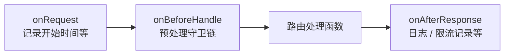

# 中间件

本章将介绍在 `Elysia Admin` 中，中间件（Middleware）用于在请求生命周期的不同阶段注入自定义逻辑。所有的中间件通常定义在 `server/src/middleware` 目录下。

## 请求预处理

如果你需要在执行具体业务逻辑之前对请求进行拦截或预处理（例如：IP 黑名单校验、认证授权等），可以使用 `onBeforeHandle` 钩子。

```ts [ts]
/**
 * 全局请求预处理中间件
 * @param app Elysia 实例
 */
export function GlobalMiddleware(app: Elysia) {
    app.onBeforeHandle(async (ctx) => {
        // IP 黑名单校验
        if (guard.ipBlacklist) await executeGuard(IpBlackGuard, ctx, '通过了黑名单IP守卫-->');
        // API 熔断开关
        if (guard.apiSwitch) await executeGuard(ApiGuard, ctx, '通过了API熔断守卫-->');
        
        // 依次执行路由分析、认证、限流及权限校验
        await executeGuard(AnalysisRoute, ctx, '通过了路由分析器-->');
        await executeGuard(AuthGuard, ctx, '通过了认证守卫-->');
        await executeGuard(IpRateLimitGuard, ctx, '通过了ip限流守卫-->');
        await executeGuard(PermissionGuard, ctx, '通过了权限守卫-->');
    });
};
```

## 响应后处理

如果你需要对响应结果进行统一处理，或者在响应发送后执行异步任务（例如：记录操作日志、统计响应时间等），可以结合 `onRequest` 和 `onAfterResponse` 钩子。

```ts [ts]
/**
 * 全局响应层中间件
 * @param app Elysia 实例
 */
export function GlobalResponseMiddleware(app: Elysia) {
    // 记录请求开始时间
    app.onRequest((ctx) => {
        ctx.startTime = Date.now();
    });

    // 响应完成后执行
    app.onAfterResponse(async (ctx) => {
        // 非生产环境下打印请求日志
        process.env.NODE_ENV !== 'production' && logger.logRequest(ctx);
        
        // 记录操作日志及 IP 限流数据
        await AddOperLog(ctx);
        await IpRateLimitRecord(ctx);
    });
};
```

## 获取上下文数据

在 `handle.ts` 中请使用项目定义的 `AppContext`（`Context` 与中间件挂载字段的交集类型），直接访问 `user`、`routeInfo` 等，无需 `(ctx as any)`：

```ts [ts]
import type { AppContext } from '@/types/app-context';
import { GetClientIp } from '@/shared/ip';
import { BaseResultData } from '@/core/result';

/**
 * 示例业务处理函数
 * @param ctx 请求上下文（含中间件注入字段）
 */
export async function handleRequest(ctx: AppContext) {
    try {
        const startTime = ctx.startTime;   // onRequest 记录的开始时间
        const user = ctx.user;             // 认证守卫注入的当前用户
        const routeInfo = ctx.routeInfo;   // 路由分析器注入的 meta 等
        const routeKey = ctx.routeKey;     // 路由唯一键
        const ip = ctx.ip ?? GetClientIp(ctx); // IP 守卫会写入 ctx.ip

        // 执行后续业务逻辑...
    } catch (error) {
        return BaseResultData.fail(500, error);
    }
}
```

## 请求生命周期概览

`Elysia` 将一次请求拆成多个钩子：进入路由前可先记录元数据（如开始时间），在 `onBeforeHandle` 中集中做黑名单、认证、限流、权限等**前置校验**；通过后执行真实业务处理函数；响应发出前或在之后触发 `onAfterResponse`，适合写操作日志、落库限流统计等**副作用**。下图是三类中间件的简化执行顺序，具体守卫是否启用以 `GlobalMiddleware`、`GlobalResponseMiddleware` 及环境变量为准。



若某一环返回响应（例如认证失败），后续业务处理函数不会执行，这一点在排查「为何接口未进 Controller」时很有用。