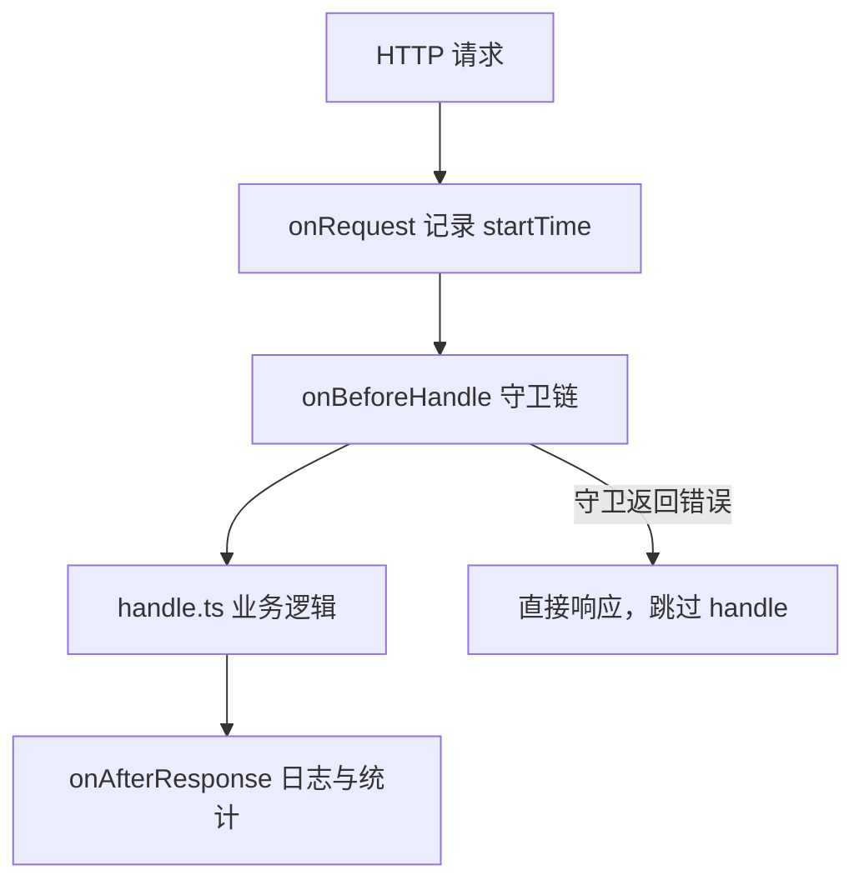

# 中间件

中间件在请求生命周期的不同阶段注入通用逻辑：进入业务 `handle` 之前做鉴权与限流，响应发出之后写操作日志。代码集中在 `server/src/middleware/`，在 `app.ts` 里通过 `GlobalMiddleware` 和 `GlobalResponseMiddleware` 挂载。

路由上的 `meta` 字段（`isAuth`、`permission`、`ipRateLimit` 等）决定哪些守卫会生效，配置方式见 [第一个接口](./first-api)。



任一守卫返回错误响应时，后续 `handle` 不会执行。排查「接口没进业务逻辑」时，可先确认认证、权限或限流是否在中途拦截。

## 请求预处理

`onBeforeHandle` 里按顺序执行守卫。守卫返回 `BaseResultData.fail(...)` 时，`executeGuard` 会抛出并中断请求。

```ts [middleware/index.ts]
import { Elysia } from 'elysia';
import config from '@/config';
import { AnalysisRoute } from './analysis';
import { AuthGuard } from './guards/auth';
import { PermissionGuard } from './guards/permission';
import { IpBlackGuard } from './guards/ipblack';
import { ApiGuard } from './guards/api';
import { IpRateLimitGuard } from './guards/ipratelimit';

const { guard } = config;

export function GlobalMiddleware(app: Elysia) {
    app.onBeforeHandle(async (ctx) => {
        if (guard.ipBlacklist) await executeGuard(IpBlackGuard, ctx);
        if (guard.apiSwitch) await executeGuard(ApiGuard, ctx);
        await executeGuard(AnalysisRoute, ctx);
        await executeGuard(AuthGuard, ctx);
        await executeGuard(IpRateLimitGuard, ctx);
        await executeGuard(PermissionGuard, ctx);
    });
}
```

| 守卫 | 作用 | 触发条件 |
|------|------|----------|
| `IpBlackGuard` | IP 黑名单拦截 | `config.guard.ipBlacklist` 开启 |
| `ApiGuard` | API 熔断开关 | `config.guard.apiSwitch` 开启 |
| `AnalysisRoute` | 解析当前路由，注入 `routeInfo`、`routeKey` | 始终执行 |
| `AuthGuard` | JWT 认证，注入 `ctx.user` | 路由 `meta.isAuth: true` |
| `IpRateLimitGuard` | IP 限流 | 路由配置了 `meta.ipRateLimit` |
| `PermissionGuard` | 按钮权限校验 | 路由配置了 `meta.permission` |

自定义守卫放在 `middleware/guards/` 下，按同样方式 `executeGuard` 接入即可。

## 响应后处理

`onRequest` 记录请求开始时间，`onAfterResponse` 在响应完成后执行副作用，不阻塞返回。

```ts [middleware/index.ts]
import { logger } from '@/shared/logger';
import { AddOperLog } from '@/modules/system-oper-log/handle';
import { IpRateLimitRecord } from './guards/ipratelimit';

export function GlobalResponseMiddleware(app: Elysia) {
    app.onRequest((ctx) => {
        ctx.startTime = Date.now();
    });

    app.onAfterResponse(async (ctx) => {
        process.env.NODE_ENV !== 'production' && logger.logRequest(ctx);
        await AddOperLog(ctx);
        await IpRateLimitRecord(ctx);
    });
}
```

| 钩子 | 时机 | 典型用途 |
|------|------|----------|
| `onRequest` | 请求刚进入 | 记录 `startTime` |
| `onAfterResponse` | 响应已发出 | 操作日志、限流计数、开发环境请求日志 |

路由 `meta.isLog: true` 时，`AddOperLog` 会把本次请求写入操作日志表。

## 在 handle 里读上下文

`handle.ts` 使用 `AppContext` 类型（`@/types/app-context`），直接访问中间件注入的字段，无需 `(ctx as any)`。

```ts [handle.ts]
import type { AppContext } from '@/types/app-context';
import { GetClientIp } from '@/shared/ip';
import { BaseResultData } from '@/core/result';

export async function handleRequest(ctx: AppContext) {
    const startTime = ctx.startTime;           // onRequest
    const user = ctx.user;                     // AuthGuard
    const routeInfo = ctx.routeInfo;           // AnalysisRoute
    const routeKey = ctx.routeKey;
    const ip = ctx.ip ?? GetClientIp(ctx);     // IpBlackGuard 等

    // 业务逻辑...
    return BaseResultData.ok();
}
```

常用注入字段：

| 字段 | 来源 | 说明 |
|------|------|------|
| `routeInfo` | `AnalysisRoute` | 当前路由的 `tags`、`summary`、`meta` |
| `routeKey` | `AnalysisRoute` | 路由唯一键，如 `GET:/api/system/user/list` |
| `user` | `AuthGuard` | 当前登录用户（含 `permissions`） |
| `startTime` | `onRequest` | 请求开始时间戳 |
| `ip` | IP 相关守卫 | 客户端 IP |

## 错误处理

全局异常由 `middleware/error-handler.ts` 的 `ConfigureErrorHandler` 统一捕获，在 `app.ts` 中与上述中间件一并注册。业务层用 `BaseResultData.fail(code, msg)` 返回错误即可，不必在 `handle` 里包 `try/catch`。
