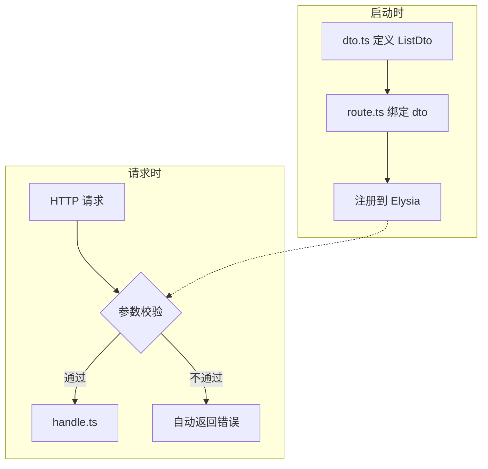

# 参数验证

每个业务模块的 `dto.ts` 负责两件事：校验前端传来的 `body` / `query` / `params`，以及声明接口成功时的响应结构。校验不通过时，Elysia 会自动返回错误，不会进入 `handle.ts`。

`query`、`params`、`body` 的基础写法基于 Elysia 内置的 TypeBox，这里不展开。需要时可直接查阅官方文档：

- [Elysia 参数校验](https://elysiajs.com/essential/validation.html)
- [Elysia TypeBox](https://elysiajs.com/validation/typebox.html)

下文介绍项目封装的 DTO 工具，以及标准 CRUD 模块里最常见的写法。

## 在模块里怎么用

`dto.ts` 定义校验规则，`route.ts` 通过 `dto` 字段引用；服务启动时注册到 Elysia。请求到达后，先按规则校验参数，通过才进入 `handle.ts`。



`dto.ts` 导出规则，`route.ts` 只负责绑定：

```ts [dto.ts]
import { t } from 'elysia';
import { CrudDto } from '@/types/dto';
import { InsertBusinessGoods, SelectBusinessGoods } from '@database/schema/business_goods';

export const CreateDto = CrudDto.create(
    InsertBusinessGoods,
    SelectBusinessGoods,
    ['name', 'price']
);

export const ListDto = CrudDto.list(SelectBusinessGoods, {
    name: t.Optional(t.String({ description: '商品名称' })),
});
```

```ts [route.ts]
import { CreateDto, ListDto } from './dto';
import { create, findList } from './handle';

const routes = [
    { url: '/business/goods', method: 'post', dto: CreateDto, handle: create, /* meta... */ },
    { url: '/business/goods/list', method: 'get', dto: ListDto, handle: findList, /* meta... */ },
];
```

更完整的模块搭建流程见 [第一个接口](./first-api)。

## 响应格式

项目接口统一返回 `{ code, msg, data }`。`BaseResultDto` 和 `BaseResultListDto` 用来在 OpenAPI 文档里声明这个结构，并约束 `data` 的类型。

**单条数据**

```json
{
    "code": 200,
    "msg": "success",
    "data": {
        "goodsId": 1,
        "name": "示例商品",
        "price": 99
    }
}
```

**分页列表**

```json
{
    "code": 200,
    "msg": "success",
    "data": {
        "list": [
            { "goodsId": 1, "name": "示例商品" }
        ],
        "total": 100
    }
}
```

`handle.ts` 里用 `BaseResultData.ok(data)` 返回，格式会自动对齐 DTO 声明。

## BaseResultDto

声明「成功时 `data` 是某个对象」的响应。常与 `body` / `query` 写在同一个导出对象里。

```ts [dto.ts]
import { t } from 'elysia';
import { BaseResultDto } from '@/types/dto';

export const DetailDto = {
    ...BaseResultDto(t.Object({
        goodsId: t.Number(),
        name: t.String(),
        price: t.Number(),
    })),
};
```

`CrudDto.create` / `update` / `findOne` 内部已自动带上 `BaseResultDto`，一般不需要手写。

## BaseResultListDto

声明分页列表响应，`data.list` 为数组，`data.total` 为总数。

```ts [dto.ts]
import { t } from 'elysia';
import { BaseResultListDto } from '@/types/dto';

export const CustomListDto = {
    query: t.Object({
        pageNum: t.Number({ default: 1 }),
        pageSize: t.Number({ default: 10 }),
        keyword: t.Optional(t.String()),
    }),
    ...BaseResultListDto(t.Object({
        goodsId: t.Number(),
        name: t.String(),
    })),
};
```

`CrudDto.list` 已内置 `BaseResultListDto`，标准列表接口优先用它。

## BaseListQueryDto

列表查询的 `query` 基座，自带分页、排序、时间范围字段，再叠加业务筛选条件。

内置字段：

| 字段 | 说明 | 默认 |
|------|------|------|
| `pageNum` | 页码 | 1 |
| `pageSize` | 每页条数 | 10 |
| `orderByColumn` | 排序字段 | 可选 |
| `sortRule` | 排序规则 | 可选 |
| `startTime` | 开始时间 | 可选 |
| `endTime` | 结束时间 | 可选 |

```ts [dto.ts]
import { t } from 'elysia';
import { BaseListQueryDto } from '@/types/dto';

export const SearchDto = {
    query: BaseListQueryDto({
        name: t.Optional(t.String({ description: '商品名称' })),
        status: t.Optional(t.Boolean({ description: '状态' })),
    }),
};
```

`handle.ts` 里可直接解构 `ctx.query`，分页字段已经过校验。

## CrudDto

基于 Drizzle 的 `InsertXxx` / `SelectXxx` schema 快速生成标准 CRUD 的 DTO。新建模块时脚手架会生成骨架，你通常只需调整必填字段和额外查询项。

| 方法 | 用途 | 生成内容 |
|------|------|----------|
| `create` | 新增 | `body` + 单条响应 |
| `update` | 更新 | `body`（主键必填，其余可选）+ 单条响应 |
| `list` | 分页列表 | `query`（含分页）+ 列表响应 |
| `findAll` | 全量查询 | `query` + 数组响应 |
| `findOne` | 单条详情 | 单条响应 |

### create

指定哪些字段必填，其余字段从 `insertSchema` 自动变为可选。

```ts [dto.ts]
import { CrudDto } from '@/types/dto';
import { InsertBusinessGoods, SelectBusinessGoods } from '@database/schema/business_goods';

export const CreateDto = CrudDto.create(
    InsertBusinessGoods,
    SelectBusinessGoods,
    ['name', 'price', 'stock']
);
```

### update

主键必填，其他字段可选。日期字段 `createTime` / `updateTime` 接受 ISO 字符串。

```ts [dto.ts]
export const UpdateDto = CrudDto.update(SelectBusinessGoods, 'goodsId');

// 需要额外字段时传入第四个参数
export const UpdateDto = CrudDto.update(SelectBusinessGoods, 'goodsId', {
    tags: t.Optional(t.Array(t.String())),
});
```

### list

分页查询，在 `BaseListQueryDto` 上叠加筛选字段。

```ts [dto.ts]
export const ListDto = CrudDto.list(SelectBusinessGoods, {
    name: t.Optional(t.String({ description: '商品名称' })),
    status: t.Optional(t.Boolean({ description: '状态' })),
});
```

敏感字段（如密码）可在传入前用 `t.Omit` 去掉：

```ts [dto.ts]
export const ListDto = CrudDto.list(
    t.Omit(SelectSystemUser, ['password']),
    { username: t.Optional(t.String()) }
);
```

### findAll

不分页，返回全部匹配数据。`query` 只包含你传入的筛选字段。

```ts [dto.ts]
export const FindAllDto = CrudDto.findAll(SelectBusinessGoods, {
    status: t.Optional(t.Boolean({ description: '状态' })),
});
```

### findOne

详情接口，只声明响应结构。路径参数 `id` 由路由 `url` 定义，不在 DTO 里重复写。

```ts [dto.ts]
export const FindOneDto = CrudDto.findOne(SelectBusinessGoods);
```


## 工具函数

### CreateUpdateDto

`CrudDto.update` 内部使用。需要手写更新 DTO、又不想逐个字段标 `Optional` 时，可以直接用它：主键必填，其余字段可选，日期字段按字符串处理。

```ts [dto.ts]
import { CreateUpdateDto } from '@/types/dto';
import { SelectBusinessGoods } from '@database/schema/business_goods';

export const CustomUpdateDto = {
    body: CreateUpdateDto(SelectBusinessGoods, 'goodsId'),
};
```

### ParseDateFields

前端传来的 `createTime` / `updateTime` 是字符串，写入数据库前转成 `Date`。

```ts [handle.ts]
import { ParseDateFields } from '@/types/dto';

export async function update(ctx: AppContext) {
    const data = ParseDateFields(ctx.body);
    // data.createTime / data.updateTime 已是 Date 对象
}
```

## 非标准接口

不是所有接口都走 `CrudDto`。登录、改密码、自定义业务动作等，直接在 `dto.ts` 手写 `body` / `query` 即可。

```ts [dto.ts]
export const ChangePasswordDto = {
    body: t.Object({
        oldPassword: t.String({ description: '旧密码' }),
        newPassword: t.String({ description: '新密码' }),
    }),
};
```

```ts [route.ts]
{ url: '/system/user/password', method: 'put', dto: ChangePasswordDto, handle: updatePassword, meta: { /* ... */ } }
```

校验规则和响应声明保持在 `dto.ts`，`route.ts` 只做绑定——这和标准 CRUD 的做法一致。