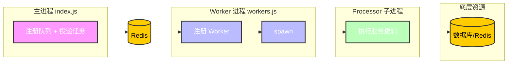

# 队列

本章将详细介绍如何使用系统内置的队列工具，包括任务投递、定时调度、自定义队列、重试策略、限流控制等能力。

系统基于 **BullMQ Sandboxed Processors** 实现队列，每个任务在独立子进程中执行，不会阻塞主进程事件循环。

## 一、架构概览



系统采用三层隔离：

- **主进程 vs Worker 进程**：Worker 崩溃不影响 HTTP 服务。
- **Worker 进程 vs Processor 子进程**：单个任务崩溃不影响其他任务。
- **Processor 子进程互相隔离**：CPU 密集型任务不会 block 事件循环，不产生 stalled jobs。

## 二、启动服务

```bash [bun]
# 同时启动主进程和 Worker 进程
bun dev:all

# 或分开启动
bun dev          # 仅主进程
bun dev:workers  # 仅 Worker 进程
```

## 三、投递任务

所有投递操作通过 `queueManager` 完成，在主进程任意位置均可使用。

### 1. 基本投递

```ts [ts]
import { queueManager } from '@/infrastructure/queue';

await queueManager.addJob('trade-order-queue', {
    orderId: 'ORD-001',
    action: 'pay',
    orderData: { amount: 100 },
});
```

### 2. 延迟任务

```ts [ts]
// 30 分钟后执行
await queueManager.addJob('trade-order-queue', {
    orderId: 'ORD-001',
    action: 'cancel',
}, {
    delay: 30 * 60 * 1000,
});
```

### 3. 优先级任务

数字越小优先级越高，`1` 为最高优先级。

```ts [ts]
await queueManager.addJob('flow-buffer-queue', data, {
    priority: 1,
});
```

### 4. 幂等投递

指定 `jobId` 后，相同 ID 的任务不会重复入队，适合防止重复提交。

```ts [ts]
await queueManager.addJob('trade-order-queue', data, {
    jobId: `pay-${orderId}`,
});
```

### 5. 批量投递

```ts [ts]
await queueManager.addBulkJobs('flow-buffer-queue', [
    { data: { action: 'write', payload: { userId: 1 } } },
    { data: { action: 'write', payload: { userId: 2 } } },
    { data: { action: 'write', payload: { userId: 3 } } },
]);
```

### 6. 控制任务保留数量

```ts [ts]
await queueManager.addJob('system-cron-queue', data, {
    removeOnComplete: 100,  // 完成后只保留最近 100 条
    removeOnFail: 200,      // 失败后只保留最近 200 条
});
```

## 四、定时任务（Cron）

定时任务基于 BullMQ 的 `repeat` 机制，任务数据持久化在 Redis 中，服务重启后自动恢复，无需重新注册。

### 1. 注册定时任务

```ts [ts]
import { queueManager, schedule } from '@/infrastructure/queue';

const queue = queueManager.getQueue('system-cron-queue')!;

// 每天凌晨 2 点执行
await schedule(queue, 'daily-cleanup', {
    cron: '0 2 * * *',
    data: {
        taskName: 'cleanup',
        jobArgs: JSON.stringify([30]),
    },
});
```

### 2. 移除定时任务

```ts [ts]
import { removeSchedule } from '@/infrastructure/queue';

await removeSchedule(queue, 'daily-cleanup', '0 2 * * *');
```

### 3. 常用 Cron 表达式

| 表达式 | 说明 |
|--------|------|
| `* * * * *` | 每分钟 |
| `*/5 * * * *` | 每 5 分钟 |
| `0 * * * *` | 每小时整点 |
| `0 2 * * *` | 每天凌晨 2 点 |
| `0 2 * * 1` | 每周一凌晨 2 点 |
| `0 2 1 * *` | 每月 1 日凌晨 2 点 |

建议使用 [Cron 表达式在线生成工具](https://tool.lu/crontab/) 进行校验。

## 五、自定义队列

以新增 `email-notify` 邮件通知队列为例。

### 1. 创建队列文件

```ts [ts]
// src/infrastructure/queue/queues/email-notify/queue.ts
import { queueManager } from '../../core';

export default queueManager.registerQueue({
    name: 'email-notify-queue',
    description: '邮件通知队列',
});
```

### 2. 创建 Processor 文件

```ts [ts]
// src/infrastructure/queue/queues/email-notify/processor.ts
import type { SandboxedJob } from 'bullmq';
import { createTaskRegistry, parseArgs } from '../../core/processor-utils';

const { register, get } = createTaskRegistry();

register('sendEmail', async (to: string, subject: string, body: string) => {
    // 可以直接使用数据库、SMTP 等工具
    console.log(`发送邮件到 ${to}: ${subject}`);
});

export default async function processor(job: SandboxedJob) {
    const { taskName, jobArgs } = job.data;
    const taskFn = get(taskName);
    if (!taskFn) throw new Error(`未找到任务: ${taskName}`);
    await taskFn(...parseArgs(jobArgs));
    return { success: true };
}
```

> Processor 运行在独立子进程中，可以正常使用数据库、Redis 等所有工具，但无法访问主进程的内存单例（如已建立的连接对象）。子进程会自行初始化所需的连接。

### 3. 创建 Worker 注册文件

```ts [ts]
// src/infrastructure/queue/queues/email-notify/worker.ts
import path from 'path';
import { queueManager, RateLimitPresets } from '../../core';

const processorFile = path.resolve(process.cwd(), 'dist/processors/email-notify.js');

queueManager.registerWorker({
    queueName: 'email-notify-queue',
    processor: processorFile,
    options: {
        concurrency: 5,
        ...RateLimitPresets.low,
    },
});
```

### 4. 注册到 runtime

```ts [ts]
// src/infrastructure/queue/runtime/app.ts
import '../queues/email-notify/queue';  // 加这一行

// src/infrastructure/queue/runtime/worker.ts
import '../queues/email-notify/worker'; // 加这一行
```

### 5. 加入构建脚本

在 `script/build-processors.ts` 和 `script/build.ts` 的 `processors` 数组中加入：

```ts [ts]
{ name: 'email-notify', entry: './src/infrastructure/queue/queues/email-notify/processor.ts' },
```

### 6. 构建并使用

```bash [bun]
bun build:processors
```

```ts [ts]
await queueManager.addJob('email-notify-queue', {
    taskName: 'sendEmail',
    jobArgs: JSON.stringify(['user@example.com', '验证码', '您的验证码是 123456']),
});
```

## 六、重试策略

### 1. 使用预设

```ts [ts]
import { RetryPresets } from '@/infrastructure/queue';

await queueManager.addJob('trade-order-queue', data, {
    ...RetryPresets.aggressive,
});
```

| 预设 | 策略 | 次数 | 初始延迟 |
|------|------|------|---------|
| `RetryPresets.none` | 不重试 | 1 | - |
| `RetryPresets.standard` | 固定间隔 | 3 | 2s |
| `RetryPresets.aggressive` | 指数退避 | 5 | 1s |

### 2. 自定义重试

```ts [ts]
import { buildRetry } from '@/infrastructure/queue';

// 固定间隔：失败后等 5 秒重试，最多 3 次
await queueManager.addJob('email-notify-queue', data, {
    ...buildRetry({ attempts: 3, strategy: 'fixed', delay: 5000 }),
});

// 指数退避：1s → 2s → 4s → 8s，最多 4 次
await queueManager.addJob('trade-order-queue', data, {
    ...buildRetry({ attempts: 4, strategy: 'exponential', delay: 1000 }),
});
```

## 七、限流控制

限流在 Worker 注册时配置，控制单位时间内最多处理多少个任务。

### 1. 使用预设

```ts [ts]
import { RateLimitPresets } from '@/infrastructure/queue';

queueManager.registerWorker({
    queueName: 'email-notify-queue',
    processor: processorFile,
    options: {
        concurrency: 5,
        ...RateLimitPresets.low,  // 每秒最多 5 个
    },
});
```

| 预设 | 每秒上限 | 适用场景 |
|------|---------|---------|
| `RateLimitPresets.low` | 5 | 邮件、短信等外部 API |
| `RateLimitPresets.medium` | 20 | 普通业务处理 |
| `RateLimitPresets.high` | 100 | 高并发写入缓冲 |

### 2. 自定义限流

```ts [ts]
import { buildRateLimit } from '@/infrastructure/queue';

options: {
    concurrency: 10,
    ...buildRateLimit({ max: 50, duration: 2000 }), // 2 秒内最多 50 个
}
```

> `concurrency` 控制同时处理的任务数，`limiter` 控制单位时间内的速率，两者共同作用。

## 八、Processor 开发说明

### 1. 记录任务日志和进度

```ts [ts]
export default async function processor(job: SandboxedJob) {
    await job.log('开始处理...');
    await job.updateProgress(50);
    await job.log('处理完成');
    return { success: true };
}
```

### 2. 在 Processor 中投递新任务

Processor 子进程无法使用主进程的 `queueManager` 单例，需要自行创建 Queue 实例。

```ts [ts]
import { Queue } from 'bullmq';
import { getQueueEnvConfig } from '../../config/env';
import Redis from 'ioredis';

const cfg = getQueueEnvConfig();
const conn = new Redis({ host: cfg.redis.host, port: cfg.redis.port, maxRetriesPerRequest: null });
const notifyQueue = new Queue(`${cfg.appId}-email-notify-queue`, { connection: conn });

await notifyQueue.add('sendEmail', { to: 'user@example.com' });
```

### 3. 修改后重新构建

每次修改 `processor.ts` 后必须重新构建，否则子进程运行的仍是旧代码。

```bash [bun]
bun build:processors
```

## 九、监控面板

启动主进程后访问 Bull Board 可视化面板：

```bash [terminal]
http://localhost:{port}{prefix}/bullmq
```

面板支持查看所有队列的任务状态（等待、活跃、完成、失败、延迟）、手动重试失败任务、清空队列、查看任务详情和日志。

## 十、多实例与高可用

系统基于 **BullMQ** 的分布式队列机制，天然支持多实例部署：

- BullMQ 通过 Redis 保证同一任务在同一时间只被一个 Worker 消费，无需额外的分布式锁。
- Worker 进程崩溃后由 PM2 自动重启，不影响主进程（HTTP 服务）。
- 任务数据持久化在 Redis 中，重启后未完成的任务会自动恢复。

## 十一、相关链接

- [BullMQ 官方文档](https://docs.bullmq.io/)
- [BullMQ Sandboxed Processors](https://docs.bullmq.io/guide/workers/sandboxed-processors)
- [BullMQ Repeatable Jobs](https://docs.bullmq.io/guide/jobs/repeatable)
- [BullMQ Rate Limiting](https://docs.bullmq.io/guide/rate-limiting)
- [BullMQ Retrying Jobs](https://docs.bullmq.io/guide/retrying-failing-jobs)
- [Bull Board 可视化面板](https://github.com/felixmosh/bull-board)
- [Cron 表达式在线生成工具](https://tool.lu/crontab/)
- [ioredis 文档](https://github.com/redis/ioredis)