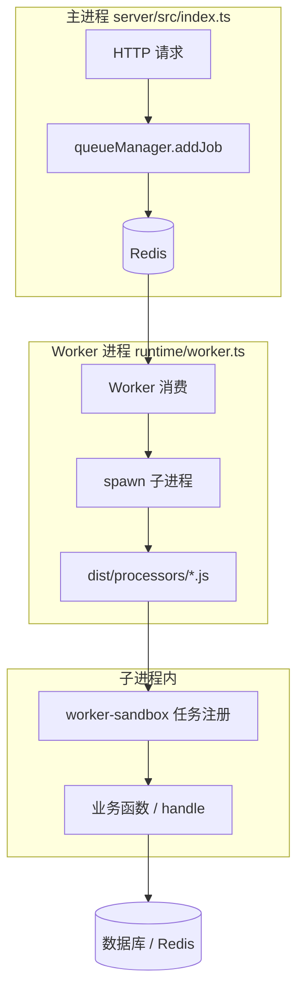

# 队列

有些业务不适合在 HTTP 请求里同步做完，比如发邮件、订单超时取消、批量导出。这类任务可以丢进队列，由后台 Worker 异步执行，接口快速返回，用户不用干等。

项目基于 **BullMQ Sandboxed Processors** 实现：主进程负责接收请求并投递任务；Redis 存队列；独立 Worker 进程取任务后，在**子进程**里跑 Processor，避免阻塞 HTTP 事件循环。

定时任务也走同一套设施（`system-cron-queue`），区别只是触发方式。沙箱注册与后台配置见 [定时任务](./cron)。

## 架构概览

先把进程边界搞清楚，后面自定义队列时才知道文件该写在哪。



三层隔离：

| 层级 | 说明 |
|------|------|
| 主进程 vs Worker | Worker 挂了，网站照常响应 |
| Worker vs Processor 子进程 | 某个任务崩溃，不影响同队列其他任务 |
| 子进程互相隔离 | 耗时计算不会卡住 Worker 事件循环 |

关键目录：

| 路径 | 作用 |
|------|------|
| `infrastructure/queue/queues/*/queue.ts` | 注册队列（主进程加载） |
| `infrastructure/queue/queues/*/worker.ts` | 注册 Worker（Worker 进程加载） |
| `infrastructure/queue/queues/*/processor.ts` | 子进程入口，构建到 `dist/processors/` |
| `worker-sandbox/*-tasks.ts` | 业务函数注册，可 import `modules` |
| `runtime/app.ts` / `runtime/worker.ts` | 汇总 import 各队列 |

## 启动服务

本地开发至少要有一个 Worker 在跑，否则任务只会堆在 Redis 里没人消费。

```bash
cd server

# 推荐：HTTP + Worker 一起启
bun run dev:all

# 或分开启（调试 Worker 时常用）
bun run dev           # 仅主进程
bun run dev:workers   # 仅 Worker（内部会先执行 build:processors）
```

改动了 `processor.ts` 或 `worker-sandbox/*.ts` 后，必须重新构建 Processor，否则子进程跑的仍是旧代码：

```bash
bun run build:processors
# 然后重启 Worker（dev:workers 或 PM2）
```

## 投递任务

所有投递通过 `queueManager` 完成，在 `handle.ts`、定时逻辑等主进程代码里均可调用。

```ts
import { queueManager } from '@/infrastructure/queue';
```

项目内置三个队列，可以先对照理解再自定义：

| 队列名 | 用途 | Processor 模式 |
|--------|------|----------------|
| `system-cron-queue` | 定时任务 | `taskName` + `jobArgs` |
| `flow-buffer-queue` | 延迟/缓冲类业务 | 按 `job.name` 分发 |
| `trade-order-queue` | 订单示例（演示用） | 直接读 `job.data` |

### 基本投递

最常用的写法，把业务数据放进 `job.data`，Worker 在子进程里读取。

```ts
await queueManager.addJob('trade-order-queue', {
    orderId: 'ORD-001',
    action: 'pay',
    orderData: { amount: 100 },
});
```

`trade-order` 的 Processor 会根据 `action` 分支处理（`create` / `pay` / `cancel` / `refund`），可在 `queues/trade-order/processor.ts` 查看示例。

### 延迟任务

`delay` 单位为毫秒。适合「下单后 30 分钟未支付自动取消」这类场景。

```ts
// 30 分钟后执行
await queueManager.addJob('trade-order-queue', {
    orderId: 'ORD-001',
    action: 'cancel',
}, {
    delay: 30 * 60 * 1000,
});
```

项目里订单模块的真实写法（`flow-buffer-queue`，按 `job.name` 分发）：

```ts
// server/src/modules/business-orders/handle.ts（节选）
const queue = queueManager.getQueue('flow-buffer-queue')!;
await queue.add('订单超时处理', { orderNo }, { delay: timeout });
```

这里的 `'订单超时处理'` 必须与 `worker-sandbox/flow-buffer-tasks.ts` 里 `register('订单超时处理', ...)` 的名称一致。

### 优先级

数字**越小**优先级**越高**，`1` 为最高。多任务积压时，高优先级先被消费。

```ts
await queueManager.addJob('flow-buffer-queue', data, {
    priority: 1,
});
```

### 幂等投递

传入 `jobId` 后，相同 ID 的任务不会重复入队。适合防止用户重复点击、接口重试导致重复扣款。

```ts
const orderId = 'ORD-001';
await queueManager.addJob('trade-order-queue', data, {
    jobId: `pay-${orderId}`,
});
```

### 批量投递

一次塞多条任务，比循环 `addJob` 更高效。

```ts
await queueManager.addBulkJobs('flow-buffer-queue', [
    { data: { action: 'write', payload: { userId: 1 } } },
    { data: { action: 'write', payload: { userId: 2 } } },
    { data: { action: 'write', payload: { userId: 3 } } },
]);
```

### 控制保留数量

避免 Redis 里堆积过多历史任务记录。

```ts
await queueManager.addJob('system-cron-queue', data, {
    removeOnComplete: 100,  // 完成后只留最近 100 条
    removeOnFail: 200,      // 失败后只留最近 200 条
});
```

## 定时调度

除了后台「定时任务」页面配置外，也可以在代码里用 `schedule` 注册 Cron。规则存在 Redis 中，服务重启后自动恢复，不用每次启动重新注册。

```ts
import { queueManager, schedule, removeSchedule } from '@/infrastructure/queue';

const queue = queueManager.getQueue('system-cron-queue')!;

// 注册：每天凌晨 2 点
await schedule(queue, 'daily-cleanup', {
    cron: '0 2 * * *',
    data: {
        taskName: 'cleanup',           // 对应 worker-sandbox 注册名
        jobArgs: JSON.stringify([30]), // 传给任务函数的参数数组
    },
});

// 移除
await removeSchedule(queue, 'daily-cleanup', '0 2 * * *');
```

常用 Cron 表达式：

| 表达式 | 说明 |
|--------|------|
| `* * * * *` | 每分钟 |
| `*/5 * * * *` | 每 5 分钟 |
| `0 * * * *` | 每小时整点 |
| `0 2 * * *` | 每天凌晨 2 点 |
| `0 2 * * 1` | 每周一凌晨 2 点 |
| `0 2 1 * *` | 每月 1 日凌晨 2 点 |

建议用 [Cron 在线工具](https://tool.lu/crontab/) 校验。`taskName` 与 `worker-sandbox` 注册、后台表单「任务名称」须完全一致，详见 [定时任务](./cron)。

## 自定义队列

下面以新增 `email-notify-queue`（邮件通知）为例，从零走一遍。自定义队列本质是**新增一组文件 + 改三处注册 + 构建**。

整体 checklist：

```
queues/email-notify/queue.ts      ← 注册队列
queues/email-notify/processor.ts  ← 子进程逻辑
queues/email-notify/worker.ts     ← 注册 Worker
worker-sandbox/email-notify-tasks.ts ← 业务函数（可 import modules）
runtime/app.ts                    ← import queue
runtime/worker.ts                 ← import worker
script/build-processors.ts        ← 加入构建列表
```

### 注册队列

主进程启动时加载，用于 `addJob` 投递。

```ts
// server/src/infrastructure/queue/queues/email-notify/queue.ts
import { queueManager } from '../../core';

export default queueManager.registerQueue({
    name: 'email-notify-queue',
    description: '邮件通知队列',
});
```

### 沙箱任务

**不要**在 `processor.ts` 里直接 `import '@/modules/...'`。业务函数写在 `worker-sandbox`，保持 infrastructure 与 modules 的依赖边界（与定时任务相同）。

```ts
// server/src/worker-sandbox/email-notify-tasks.ts
import type { TaskFn } from '@/infrastructure/queue/core/processor-utils';

async function sendEmail(to: string, subject: string, body: string) {
    console.log(`发送邮件到 ${to}: ${subject}`);
    // 实际项目可 import 模块 handle：import { sendMail } from '@/modules/xxx/handle';
}

export function registerEmailNotifySandboxTasks(
    register: (name: string, fn: TaskFn) => void,
): void {
    register('sendEmail', sendEmail as TaskFn);
}
```

### Processor

构建后输出到 `dist/processors/email-notify.js`，Worker 以沙箱方式 spawn 执行。

```ts
// server/src/infrastructure/queue/queues/email-notify/processor.ts
import type { SandboxedJob } from 'bullmq';
import { registerEmailNotifySandboxTasks } from '@/worker-sandbox/email-notify-tasks';
import { createTaskRegistry, parseArgs } from '../../core/processor-utils';

const { register, get } = createTaskRegistry();
registerEmailNotifySandboxTasks(register);

export default async function processor(job: SandboxedJob) {
    const { taskName, jobArgs } = job.data;
    const taskFn = get(taskName);
    if (!taskFn) throw new Error(`未找到任务: ${taskName}`);
    await taskFn(...parseArgs(jobArgs));
    return { success: true, taskName };
}
```

子进程可以正常连数据库、Redis，但**拿不到**主进程内存里的单例（如已建立的连接对象），会在子进程内重新初始化。

### Worker

指定并发数、限流等运行参数。

```ts
// server/src/infrastructure/queue/queues/email-notify/worker.ts
import path from 'path';
import { queueManager, RateLimitPresets } from '../../core';

const processorFile = path.resolve(process.cwd(), 'dist/processors/email-notify.js');

queueManager.registerWorker({
    queueName: 'email-notify-queue',
    processor: processorFile,
    options: {
        concurrency: 5,           // 同时处理 5 个任务
        ...RateLimitPresets.low,  // 每秒最多 5 个（见下文「限流」）
    },
});
```

### 挂载与构建

`runtime/app.ts` 增加：

```ts
import '../queues/email-notify/queue';
```

`runtime/worker.ts` 增加：

```ts
import '../queues/email-notify/worker';
```

`script/build-processors.ts` 的 `processors` 数组增加：

```ts
{ name: 'email-notify', entry: './src/infrastructure/queue/queues/email-notify/processor.ts' },
```

若 `script/build.ts` 里也有 `processors` 列表，同步加上（生产构建用）。

构建并投递测试任务：

```bash
bun run build:processors
bun run dev:workers
```

```ts
await queueManager.addJob('email-notify-queue', {
    taskName: 'sendEmail',
    jobArgs: JSON.stringify(['user@example.com', '验证码', '您的验证码是 123456']),
});
```

到 Bull Board 面板确认任务从 waiting → completed。

### 任务数据格式

两种 Processor 模式**不要混用**，新手最容易在这里踩坑：

**模式 A：`taskName` + `jobArgs`**

用于 `system-cron-queue` 和上文 `email-notify` 自定义队列。

```ts
// 投递
await queueManager.addJob('email-notify-queue', {
    taskName: 'sendEmail',
    jobArgs: JSON.stringify(['a@b.com', '标题', '正文']),
});

// Processor 内
const { taskName, jobArgs } = job.data;
const taskFn = get(taskName);
await taskFn(...parseArgs(jobArgs));
```

**模式 B：按 `job.name` 分发**

用于 `flow-buffer-queue`。投递时第一个参数是任务名，`data` 整包传给函数。

```ts
// 投递（注意用 queue.add，第一个参数是 job.name）
const queue = queueManager.getQueue('flow-buffer-queue')!;
await queue.add('订单超时处理', { orderNo: 'xxx' }, { delay: 60000 });

// Processor 内（flow-buffer/processor.ts）
const taskFn = get(job.name);
await taskFn(job.data);
```

| 队列 | 投递方式 | Processor 取任务 |
|------|----------|------------------|
| `system-cron-queue` | `addJob` + `taskName` | `job.data.taskName` |
| 自定义（email-notify 示例） | 同上 | 同上 |
| `flow-buffer-queue` | `queue.add(name, data)` | `job.name` |
| `trade-order-queue` | `addJob` + 业务字段 | 直接读 `job.data` |

## 重试策略

任务失败时 BullMQ 会自动重试。投递时通过选项控制策略，也可用项目预设。

```ts
import { RetryPresets, buildRetry } from '@/infrastructure/queue';

// 预设：指数退避，最多 5 次
await queueManager.addJob('trade-order-queue', data, {
    ...RetryPresets.aggressive,
});
```

| 预设 | 策略 | 次数 | 初始延迟 |
|------|------|------|----------|
| `RetryPresets.none` | 不重试 | 1 | — |
| `RetryPresets.standard` | 固定间隔 | 3 | 2s |
| `RetryPresets.aggressive` | 指数退避 | 5 | 1s |

自定义：

```ts
// 固定间隔：失败后等 5 秒重试，最多 3 次
await queueManager.addJob('email-notify-queue', data, {
    ...buildRetry({ attempts: 3, strategy: 'fixed', delay: 5000 }),
});

// 指数退避：1s → 2s → 4s → 8s，最多 4 次
await queueManager.addJob('trade-order-queue', data, {
    ...buildRetry({ attempts: 4, strategy: 'exponential', delay: 1000 }),
});
```

对外部 API（发邮件、发短信）建议配合 `RateLimitPresets.low`，避免重试风暴把第三方打挂。

## 限流控制

限流在 **Worker 注册时**配置，控制单位时间内最多处理多少个任务，与投递时的 `addJob` 无关。

```ts
import { RateLimitPresets, buildRateLimit } from '@/infrastructure/queue';

queueManager.registerWorker({
    queueName: 'email-notify-queue',
    processor: processorFile,
    options: {
        concurrency: 5,            // 同时并发处理的任务数
        ...RateLimitPresets.low,   // 每秒最多 5 个
    },
});
```

| 预设 | 每秒上限 | 适用场景 |
|------|----------|----------|
| `RateLimitPresets.low` | 5 | 邮件、短信等外部 API |
| `RateLimitPresets.medium` | 20 | 普通业务处理 |
| `RateLimitPresets.high` | 100 | 高并发写入缓冲 |

自定义：

```ts
options: {
    concurrency: 10,
    ...buildRateLimit({ max: 50, duration: 2000 }), // 2 秒内最多 50 个
}
```

`concurrency` 是「同时跑几个」，`limiter` 是「单位时间最多跑几个」，两者同时生效。发邮件队列通常 `concurrency` 略高、`limiter` 偏低。

## Processor 开发

### 日志与进度

在 Bull Board 里可查看任务日志和进度条，调试时很有用。

```ts
export default async function processor(job: SandboxedJob) {
    await job.log('开始处理...');
    await job.updateProgress(30);
    // 业务逻辑...
    await job.updateProgress(100);
    await job.log('处理完成');
    return { success: true };
}
```

### 子进程里投递新任务

子进程**不能**用主进程的 `queueManager` 单例，需要自行创建 `Queue`：

```ts
import { Queue } from 'bullmq';
import Redis from 'ioredis';
import { getQueueEnvConfig } from '../../config/env';

const cfg = getQueueEnvConfig();
const conn = new Redis({
    host: cfg.redis.host,
    port: cfg.redis.port,
    maxRetriesPerRequest: null,
});

// 注意队列名带 appId 前缀
const notifyQueue = new Queue(`${cfg.appId}-email-notify-queue`, { connection: conn });

await notifyQueue.add('sendEmail', {
    taskName: 'sendEmail',
    jobArgs: JSON.stringify(['user@example.com', '通知', '处理完成']),
});
```

### 修改后记得构建

```bash
bun run build:processors
```

## 监控面板

登录 Admin 后台，进入 **系统监控 → 队列监控**（路径 `/monitor/bullmq`）。

面板支持：

- 查看各队列 waiting / active / completed / failed / delayed 统计
- 按状态浏览任务、查看详情与运行日志
- 延迟任务倒计时与立即执行（promote）
- 单任务 / 批量重试失败任务、删除、清空 completed/failed
- 可选 3 秒 / 5 秒自动刷新

任务一直停在 waiting，优先检查 Worker 是否在跑（`bun run dev:workers` 或 PM2 里的 worker 进程）。

## 部署与高可用

- BullMQ 通过 Redis 协调，同一任务只会被一个 Worker 消费，多实例部署一般不需要额外分布式锁
- 建议 HTTP 与 Worker 分开用 PM2 管理；Worker 崩溃重启不影响 API
- 任务数据在 Redis 中持久化，重启后未完成的任务会继续被消费

## 常见问题

- **任务不执行**：Worker 没启动，或改了 Processor 没 `build:processors`
- **未找到任务**：`taskName` / `job.name` 与 `worker-sandbox` 注册名不一致
- **两种数据格式混用**：`flow-buffer` 用 `job.name`，cron 和自定义队列用 `taskName`，见上文对照表
- **子进程报错连不上 DB**：子进程会自行初始化连接，检查环境变量与 Redis/Postgres 是否可达

## 参考

- [BullMQ 官方文档](https://docs.bullmq.io/)
- [Sandboxed Processors](https://docs.bullmq.io/guide/workers/sandboxed-processors)
- [Repeatable Jobs](https://docs.bullmq.io/guide/jobs/repeatable)
- [Rate Limiting](https://docs.bullmq.io/guide/rate-limiting)
- [Retrying Jobs](https://docs.bullmq.io/guide/retrying-failing-jobs)
- [Cron 表达式工具](https://tool.lu/crontab/)
- [ioredis](https://github.com/redis/ioredis)