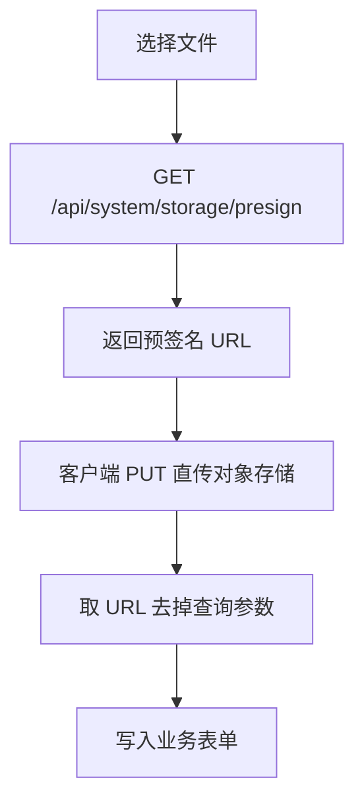

# 文件存储

项目通过 **预签名 URL** 实现文件直传：客户端先把文件 PUT 到对象存储，后端只负责签发短时 URL，不经手文件流。

支持所有兼容 S3 协议的服务，包括 RustFS（自建）、阿里云 OSS、腾讯云 COS、七牛 Kodo 等。无法采购云服务时，可用 Docker 快速部署 RustFS。

## 为什么用对象存储

文件存本地磁盘会带来迁移成本高、难横向扩展、占用后端带宽和磁盘 I/O、缺少容灾与生命周期管理等问题。对象存储把这些能力交给专用服务，后端只保存文件 URL。

## 部署 RustFS

RustFS 是兼容 S3 的开源对象存储，Docker 一键启动：

```bash
docker run -d --name rustfs_container --user root \
  -p 9000:9000 -p 9001:9001 \
  -v /mnt/rustfs/data:/data \
  -e RUSTFS_ACCESS_KEY=rustfsadmin \
  -e RUSTFS_SECRET_KEY=rustfsadmin \
  -e RUSTFS_CONSOLE_ENABLE=true \
  rustfs/rustfs:latest \
  --address :9000 --console-enable \
  --access-key rustfsadmin --secret-key rustfsadmin /data
```

| 端口 | 用途 |
|------|------|
| 9000 | S3 API，上传与下载 |
| 9001 | Web 管理控制台 |

默认凭据：`rustfsadmin` / `rustfsadmin`。生产环境务必修改 Access Key 和 Secret Key。

## 后台配置

登录后台，进入 **系统管理 → 存储配置**，填写 Endpoint、Bucket、Access Key、Secret Key 等信息后启用。


注意：

- 系统内置主流服务商模板，可快速填写
- 同一时间只能启用一种存储配置；启用新配置会自动禁用旧的

| 字段 | 说明 |
|------|------|
| 名称 | 供应商标识，如 RustFS、OSS、COS |
| Region | 服务区域；RustFS 可填 `us-east-1` |
| Endpoint | API 访问地址，不含 bucket 前缀（OSS 由代码自动拼接） |
| Bucket | 存储桶名称 |
| Access Key / Secret Key | 访问密钥 |

### 配置示例

**RustFS**

```json
{
  "name": "RustFS",
  "region": "us-east-1",
  "endpoint": "http://192.168.1.100:9000",
  "bucket": "public",
  "access_key": "rustfsadmin",
  "secret_key": "rustfsadmin"
}
```

**腾讯云 COS**

```json
{
  "name": "COS",
  "region": "ap-nanjing",
  "endpoint": "cos.ap-nanjing.myqcloud.com",
  "bucket": "my-bucket-1234567890",
  "access_key": "AKIDxxxxxxxxxxxxxxxxxxxxxxxxxxxxxxxxx",
  "secret_key": "xxxxxxxxxxxxxxxxxxxxxxxxxxxxxxxx"
}
```

`bucket` 格式为 `<桶名>-<APPID>`，密钥在「访问管理 → API 密钥管理」获取。

**阿里云 OSS**

```json
{
  "name": "OSS",
  "region": "cn-hangzhou",
  "endpoint": "oss-cn-hangzhou.aliyuncs.com",
  "bucket": "my-bucket",
  "access_key": "LTAI5txxxxxxxxxxxxxxxxxx",
  "secret_key": "xxxxxxxxxxxxxxxxxxxxxxxxxxxxxxxx"
}
```

`endpoint` 不含桶名前缀，代码内部会拼成 `<bucket>.<endpoint>`。

**七牛 Kodo**

```json
{
  "name": "Kodo",
  "region": "",
  "endpoint": "https://your-bucket.qiniudn.com",
  "bucket": "my-kodo-bucket",
  "access_key": "xxxxxxxxxxxxxxxxxxxxxxxxxxxxxxxxxxxxxxxx",
  "secret_key": "xxxxxxxxxxxxxxxxxxxxxxxxxxxxxxxxxxxxxxxx"
}
```

`endpoint` 填存储桶访问域名，`region` 可留空。

## 上传流程



后端接口 `GET /api/system/storage/presign?fileName=xxx` 会读取当前启用的存储配置，调用 `StorageService.getPresignedUrl` 签发 URL。前端封装为 `fetchGeneratePresign`（`admin/src/api/system/storage.ts`），`ArtForm` 上传组件已内置这套流程。

直传的优势：不占后端带宽、支持大文件、后端只做轻量签名。

## Web 端

浏览器用原生 `fetch` 即可完成，与 `ArtForm` 中的实现一致：

```ts
import { fetchGeneratePresign } from '@/api/system/storage'

const presignUrl = await fetchGeneratePresign({ fileName: file.name })

const response = await fetch(presignUrl, {
  method: 'PUT',
  body: file,
  headers: { 'Content-Type': file.type || 'application/octet-stream' },
})

// 持久化地址：去掉签名查询参数
const fileUrl = presignUrl.split('?')[0]
```

## uni-app / 小程序

小程序环境不能直接把 `File` 对象 PUT 出去，需要先用 `getFileSystemManager` 读出 `ArrayBuffer`，再调用后端获取预签名 URL，最后用 `uni.request` 以 `PUT` 上传。下面是一份可直接复制使用的完整示例，`generatePreSignUrl` 需对接你的 presign 接口（与 Web 端 `fetchGeneratePresign` 等价）。

```ts [ts]
/**
 * 通过文件名称检测文件类型返回对应的 Content-Type
 */
function getContentTypeByFileName(fileName: string) {
  const ext = fileName.split('.').pop()?.toLowerCase();
  if (!ext || ext === fileName) return 'application/octet-stream';
  switch (ext) {
    case 'jpg':
    case 'jpeg': return 'image/jpeg'
    case 'png': return 'image/png'
    case 'webp': return 'image/webp';
    case 'svg': return 'image/svg+xml';
    case 'gif': return 'image/gif'
    case 'mp4': return 'video/mp4'
    case 'mp3': return 'audio/mpeg';
    case 'avi': return 'video/x-msvideo'
    case 'mov': return 'video/mov'
    case 'pdf': return 'application/pdf'
    case 'docx': return 'application/vnd.openxmlformats-officedocument.wordprocessingml.document'
    case 'xlsx': return 'application/vnd.ms-excel'
    case 'txt': return 'text/plain'
    case 'csv': return 'text/csv'
    case 'wav': return 'audio/wav';
    case 'ogg': return 'audio/ogg';
    case 'html': return 'text/html';
    case 'css': return 'text/css';
    case 'js': return 'application/javascript';
    case 'json': return 'application/json'
    case 'xml': return 'application/xml'
    case 'zip': return 'application/zip'
    case 'rar': return 'application/x-rar-compressed'
    case '7z': return 'application/x-7z-compressed'
    case 'tar': return 'application/x-tar'
    case 'gz': return 'application/x-gzip'
    default: return 'application/octet-stream'
  }
}

/**
 * 通过 url 获取文件名称
 */
function getFileNameByUrl(url: string) {
  let fileName = url.split('/').pop() || ''
  const ext = fileName.split('.').pop()
  fileName = fileName.slice(0, 10)
  fileName = fileName.replace(/[^\w]/g, '_')
  return fileName + (ext ? '.' + ext : '')
}

/** 文件读成 arrayBuffer */
const fsm = uni.getFileSystemManager();
async function readFileAsBuffer(url: string) {
  return new Promise((resolve, reject) => {
    fsm.readFile({
      filePath: url,
      success(res) {
        const arrayBuffer = res.data;
        resolve(arrayBuffer)
      },
      fail(err) {
        console.error('文件读取失败:', err)
        reject(err)
      },
    })
  })
}

/** S3 预签名单文件上传 */
export function runOne(url: string): Promise<string> {
  return new Promise(async (resolve, reject) => {
    const fileName = getFileNameByUrl(url)
    const contentType = getContentTypeByFileName(fileName)
    const arrayBuffer = await readFileAsBuffer(url)
    const preSignUrl = await generatePreSignUrl(fileName)
    const fileUrl = preSignUrl.split('?')[0]
    uni.request({
      url: preSignUrl,
      method: 'PUT',
      header: { 'Content-Type': contentType },
      data: arrayBuffer,
      success(res) {
        if (res.statusCode === 200) resolve(fileUrl)
      },
      fail(err) {
        console.error('上传文件失败:', err)
        reject(err)
      },
    })
  })
}

/**
 * 简易版通用 S3 预签名文件上传
 */
export function uploadFileToS3() {
  /** 图片上传 */
  function image(options?: any): Promise<string | string[]> {
    return new Promise((resolve, reject) => {
      uni.chooseImage({
        success: async (result) => {
          const tempFilePaths = result.tempFilePaths
          const fileUrls = await Promise.all(tempFilePaths.map(runOne))
          const formate = fileUrls?.length > 1 ? fileUrls : fileUrls[0]
          resolve(formate)
        },
        fail(err) {
          console.error("选择图片失败:", err)
          reject(err)
        },
        ...options,
      })
    })
  }
  /** 视频上传 */
  function video(options?: any): Promise<string> {
    return new Promise((resolve, reject) => {
      uni.chooseVideo({
        success: async (result) => {
          const fileUrl = await runOne(result.tempFilePath) || undefined
          resolve(fileUrl)
        },
        fail(err) {
          console.error("选择视频失败:", err)
          reject(err)
        },
        ...options,
      })
    })
  }
  // #ifdef MP-WEIXIN
  /** 文件上传 */
  function file(options?: any): Promise<string | string[]> {
    return new Promise((resolve, reject) => {
      wx.chooseMessageFile({
        success: async (result) => {
          const tempFilePaths = result.tempFiles.map(item => item.path)
          const fileUrls = await Promise.all(tempFilePaths.map(runOne))
          const formate = fileUrls?.length > 1 ? fileUrls : fileUrls[0]
          resolve(formate)
        },
        fail(err) {
          console.error("选择文件失败:", err)
          reject(err)
        },
        ...options,
      })
    })
  }
  // #endif
  return {
    image,
    video,
    // #ifdef MP-WEIXIN
    file,
    // #endif
  }
}
```

使用方式：

```ts
const uploader = uploadFileToS3()
const imageUrl = await uploader.image()
const videoUrl = await uploader.video()
// 微信小程序
const fileUrl = await uploader.file()
```

## 常见问题

- **文件名**：上传前过滤特殊字符，或用 UUID 重命名，避免部分环境兼容问题
- **时效**：预签名 URL 通常 15–60 分钟有效，拿到后尽快上传
- **CORS**：跨域 PUT 失败时，检查对象存储控制台的 CORS 规则
- **Content-Type**：务必与文件类型一致，否则浏览器可能强制下载而非预览
- **微信小程序域名**：若出现 `request:fail url not in domain list`，说明请求域名未加入白名单。登录 [微信公众平台](https://mp.weixin.qq.com/) → **开发管理 → 开发设置 → 服务器域名**，将后端 API 域名（presign 接口）和对象存储 Endpoint 域名（PUT 上传）添加到 **request 合法域名**